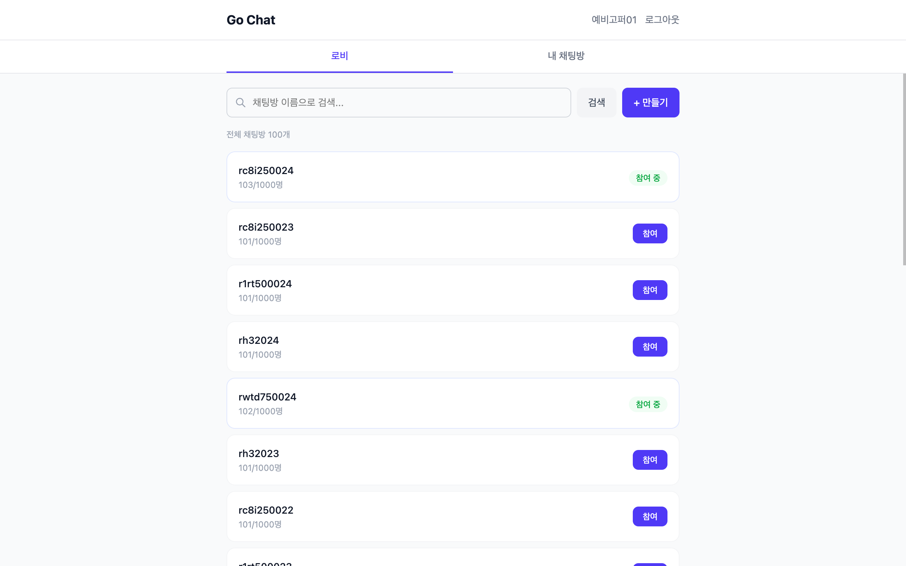
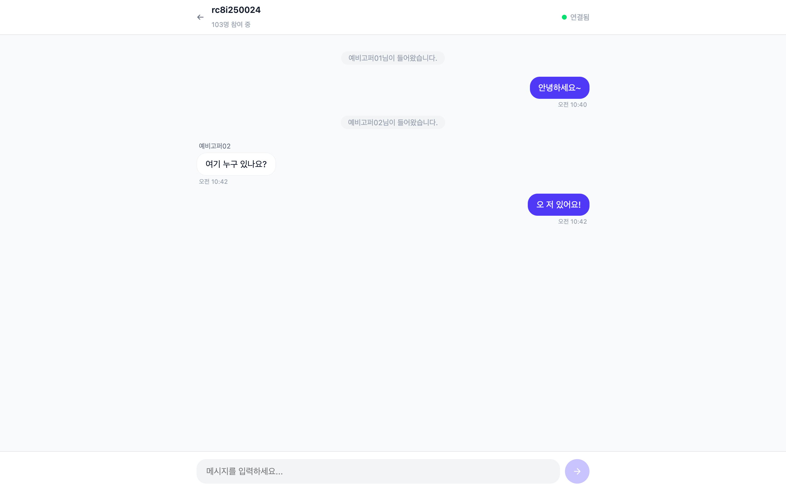
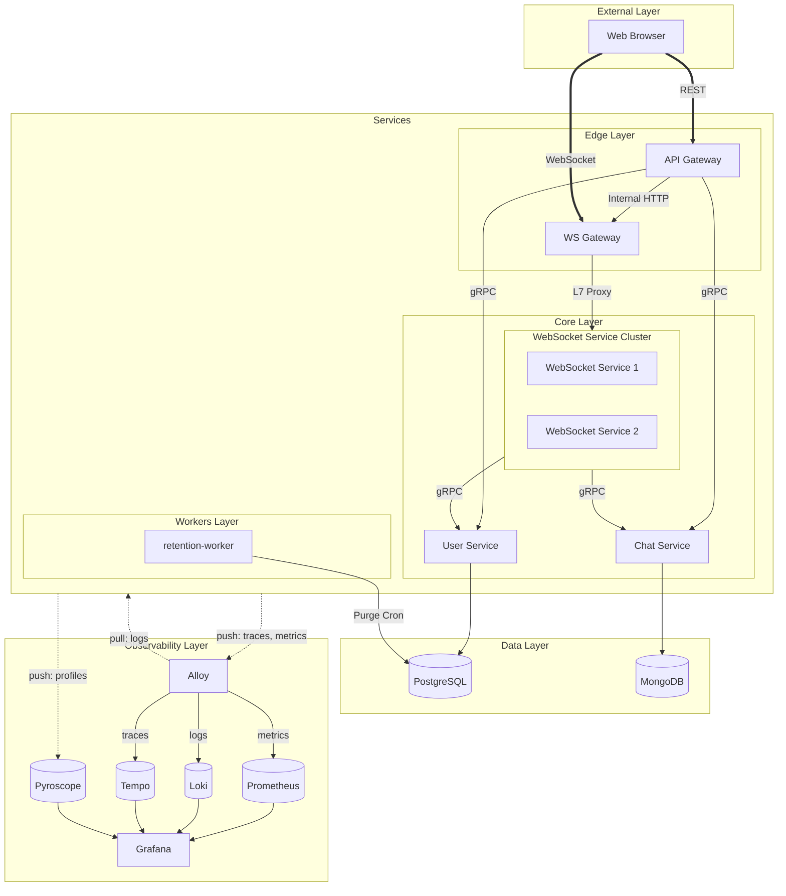
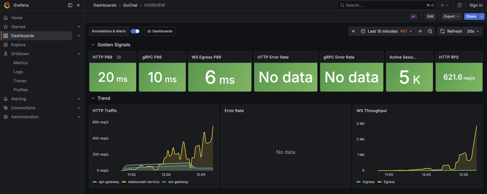

# Go Chat MSA

외부 인프라 의존성을 최소화한 Go 채팅 웹애플리케이션입니다.  
MSA로 설계했고, 관측성 확보를 위해 OTel 기반 Grafana 풀스택을 도입했습니다.  
현재는 Docker 기반 정적 인프라로 동작하지만 추후 k8s 기반의 동적 인프라로 확장 예정입니다.
- 6개 서비스가 REST · gRPC · WebSocket으로 통신
- 채팅방 기반 라우팅으로 WebSocket 노드 분배
- Grafana 스택으로 로그 · 메트릭 · 트레이스 · 프로파일 통합 관측
- k6 부하테스트로 **10,000 동시접속, 메시지 P99 레이턴시 25ms 이하** 검증

| 분류 | 기술 |
|:---|:---|
| 언어 | Go 1.26 |
| 통신 | `net/http`, `gorilla/websocket`, `google.golang.org/grpc` |
| 데이터베이스 | PostgreSQL 17 , MongoDB 8.0 |
| 인증 | `golang-jwt/jwt/v5` (HS256), `golang.org/x/crypto` (Bcrypt), Refresh Token Rotation |
| 부하분산 | `buraksezer/consistent` (Consistent Hashing) |
| 관측성 | OpenTelemetry, Grafana, Prometheus, Loki, Tempo, Pyroscope |
| 코드 생성 | Buf (Protobuf), sqlc (SQL), mockery (Mock) |
| 테스트 | `stretchr/testify`, `testcontainers-go`, k6 |
| 인프라 | Docker Compose |

### 스크린샷

> [!NOTE]
> 프론트엔드는 데모 목적으로 작성되었으며, 백엔드 설계와 구현에 초점을 맞춘 프로젝트입니다.

| 로비 | 채팅 |
|:---:|:---:|
|  |  |


---

## 실행 방법

```bash
docker compose -f docker-compose.dev.yaml up -d
```

6개 서비스, DB, 관측성 스택을 포함한 전체 인프라가 함께 실행됩니다.

| 서비스 | URL |
|:---|:---|
| 프론트엔드 | http://localhost:3001 |
| Swagger UI | http://localhost:8089 |
| Grafana | http://localhost:3000 |


> [!WARNING]
> `--profile load-test` 옵션을 추가하면 k6 워커 4대가 부하테스트를 실행합니다.
> **8코어 / 16GB RAM 이상** 환경에서 실행을 권장합니다.
---

## 아키텍처



| 서비스 | 역할 | 프로토콜 | 저장소 |
|:---|:---|:---|:---|
| api-gateway | REST API 진입점, 인증 위임, 버전 라우팅 | REST | - |
| ws-gateway | WebSocket L7 리버스 프록시, Consistent Hashing | HTTP | - |
| websocket-service | 실시간 메시지 브로드캐스트, 세션/룸 관리 | WebSocket | - |
| user-service | 사용자 및 채팅방 CRUD, Bcrypt 워커 풀 | gRPC | PostgreSQL |
| chat-service | 메시지 저장 및 조회 | gRPC | MongoDB |
| retention-worker | 소프트 삭제된 채팅방 퍼지 (매일 03:00 KST) | - | PostgreSQL |

상세 흐름은 개별 다이어그램을 참고해 주세요.

- [메시지 브로드캐스트 흐름](docs/diagrams/flow-message.mmd)
- [WebSocket 라우팅 흐름](docs/diagrams/flow-ws-routing.mmd)
- [인증 및 티켓 발급 시퀀스](docs/diagrams/seq-auth-ticket.mmd)
- [WebSocket 세션 생명주기](docs/diagrams/seq-websocket.mmd)

---

## 주요 설계 결정

상세 설계는 [DESIGN.md](docs/DESIGN.md)를 참고해 주세요.

1. **Bcrypt 워커 풀 — CPU 경합 방지**: 무제한 고루틴 대신 CPU 코어수의 워커로 동시성을 제한하여 CPU 바운드 작업 효율성을 높였습니다. 대기열이 꽉 차면 즉시 거부해서 연쇄 장애를 막습니다.

2. **채팅방 기반 라우팅 — WebSocket 분배**: Redis Pub/Sub으로 노드 간 중계하는 대신, 동일 채팅방의 모든 세션을 한 노드에 모아 인메모리 브로드캐스트합니다. 외부 인프라 병목을 줄이고, 네트워크 RTT를 없애 성능을 높였습니다.

3. **Actor 모델 — WebSocket 계층 분리**: Router → Manager → Hub → Session 4계층으로 나누고, Manager와 Hub는 각각 단일 고루틴의 `select` 루프에서 상태를 순차 처리합니다. 외부와는 채널로만 통신하기 때문에 뮤텍스 없이 동시성 안전합니다.

---

## 관측성

OpenTelemetry SDK로 계측하고 Grafana 스택으로 4가지 신호를 통합 조회합니다.  
상세 계측 항목은 [텔레메트리 카탈로그](docs/TELEMETRY_CATALOG.md)를 참고해 주세요.

| 신호 | 백엔드 | 용도 |
|:---|:---|:---|
| 로그 | Loki | 이슈 발생 확인, 트레이스 연결 |
| 메트릭 | Prometheus | HTTP, gRPC, DB, WebSocket 지표 수집 |
| 트레이스 | Tempo | 서비스 간 요청 흐름 추적 |
| 프로파일 | Pyroscope | CPU, 메모리, 고루틴 병목 분석 |

### Grafana


---

## 테스트

### 테스트 구성

| 구분 | 실행 명령어 | 설명 |
|:---|:---|:---|
| 단위 | `go test ./...` | 테이블 기반, `t.Parallel()` 병렬 실행 |
| 통합 | `go test -tags integration ./...` | Testcontainers로 실제 DB 사용, 시나리오 검증 |
| E2E | `go test -tags e2e ./test/e2e` | Testcontainers로 전체 시스템 블랙박스 검증 |
| 부하 | `docker compose -f docker-compose.dev.yaml --profile load-test up -d` | k6 4워커, 10,000 VU |

### k6 부하테스트 결과

10,000 동시접속 / 100개 방 / 2K Ingress · 200K Egress RPS 환경에서 모든 임계값을 통과했습니다(네트워크 RTT 제외).  
상세 분석은 [C10K 보고서](docs/C10K_REPORT.md)와 [트러블슈팅 기록](docs/C10K_TROUBLESHOOTING.md)을 참고해 주세요.

| 메트릭 | 임계값 | 결과 (P99) |
|:---|:---|:---|
| 메시지 지연 | < 50ms | 19 \~ 25ms |
| 히스토리 조회 | < 100ms | 10 \~ 12ms |
| 동기화 조회 | < 100ms | 15 \~ 19ms |
| 메시지 타임아웃 | < 1건 | 0건 |
