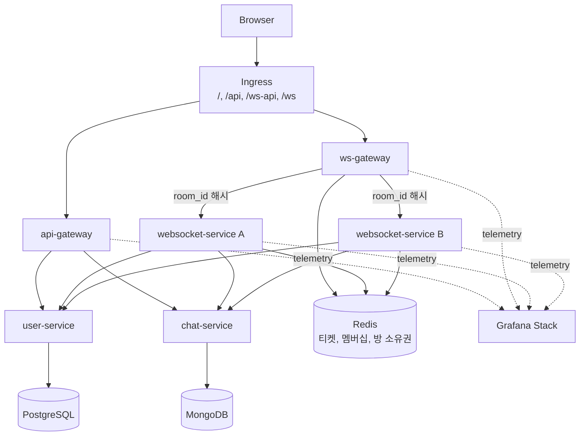

# Go Chat MSA

Go와 Kubernetes로 구현한 실시간 채팅 MSA입니다. WebSocket 서버를 수평 확장하면서도 채팅방 안의 메시지 순번 정합성을 유지하는 문제를 다룹니다.

사용자/방 관리, 메시지 저장, 실시간 연결을 각각 `user-service`, `chat-service`, `websocket-service`로 분리하고, `api-gateway`와 `ws-gateway`를 통해 HTTP와 WebSocket 진입점을 나눴습니다.

로컬 kind 환경의 C10K 부하에서 10,000 동시 연결과 100개 방을 기준으로, 약 2K Ingress msg/s와 약 200K Egress msg/s를 달성했습니다. 클라이언트 메시지 P99 레이턴시는 최대 43ms였습니다.

## 화면

채팅 흐름을 확인하기 위한 프론트엔드입니다. 이 프로젝트의 핵심은 백엔드 분산 처리와 Kubernetes 검증입니다.

| 로비 | 채팅 |
| :---: | :---: |
|  |  |

| 대시보드 |
| :---: |
|  |

## 빠른 실행

로컬 실행은 kind 기준입니다. `make dev-up`은 kind 클러스터 생성, ingress-nginx 설치, 커널 튜닝, 이미지 빌드/load, K8s bootstrap을 순서대로 수행합니다.

```bash
make dev-up
```

| 서비스 | URL |
| :--- | :--- |
| Frontend | http://dev.gochat.localhost:30080/ |
| API health | http://dev.gochat.localhost:30080/api/health |
| WS health | http://dev.gochat.localhost:30080/ws-api/health |
| OpenAPI | http://dev.gochat.localhost:30080/docs/ |
| Grafana | http://dev.gochat.localhost:30080/grafana/ |

환경별 host는 `dev`, `test`, `qa` prefix만 바뀝니다.

| 환경 | 명령 | 목적 |
| :--- | :--- | :--- |
| `dev` | `make dev-up` | 개발 확인, C10K 부하 테스트 |
| `test` | `make test-up` | 멀티 인스턴스 E2E 검증 |
| `qa` | `make qa-up` | WebSocket HPA 정합성 검증 |

## 무엇을 해결했나

- WebSocket 서버를 늘려도 같은 방 연결이 여러 인스턴스로 흩어지지 않도록 Redis 후보 목록과 consistent hashing으로 방 단위 라우팅을 구성했습니다.
- HPA나 rollout으로 담당 인스턴스가 바뀌어도 메시지 순번이 중복되거나 역전되지 않도록 방 소유권과 마지막 순번 기준값을 두었습니다.
- 메시지마다 Redis Pub/Sub을 거치지 않고 담당 Hub의 로컬 메모리에서 브로드캐스트해 Redis가 중앙 병목이 되지 않게 했습니다.
- 저장 경로가 밀릴 때는 저장 경로 자리를 먼저 확보한 메시지만 순번을 받고 브로드캐스트되도록 해, 전달됐지만 저장 경로에도 들어가지 못한 메시지 상태를 막았습니다.

## Kubernetes 전환으로 달라진 점

Docker Compose 기준점에서는 정해진 컨테이너 수에서 C10K 부하를 검증했습니다. 이번 버전에서는 실행 기준을 K8s로 옮기고, Pod 생성·종료와 HPA 확장 중에도 WebSocket 라우팅과 메시지 순번 정합성이 유지되는지를 검증했습니다.

| 항목 | Docker Compose 기준점 | Kubernetes 기준 |
| :--- | :--- | :--- |
| 실행 단위 | 고정 컨테이너 | `dev`/`test`/`qa` overlay의 Pod와 Deployment |
| WebSocket 확장 | 정적 WebSocket 노드 분산 | Redis 멤버십 기반 후보 목록과 HPA `1→2` 검증 |
| 담당 인스턴스 변경 | 정적 라우팅 중심 | 방 소유권 이전, 저장 완료 대기, 순번 기준값으로 이전 검증 |
| 배포 흐름 | Compose 일괄 기동 | `bootstrap.sh` phase 적용, migration 완료 후 앱 rollout |
| 관측/스케일 지표 | 부하 테스트 관측 중심 | WebSocket 활성 연결 수를 HPA 사용자 정의 메트릭으로 사용 |

## 기술적 판단

### 방 단위 라우팅

WS Gateway는 Redis에 등록된 WebSocket Service 후보 목록으로 해시 링을 만들고, `room_id` 기준 consistent hashing으로 담당 인스턴스를 고릅니다. 같은 방 세션을 한 인스턴스로 모으면 메시지 순번 부여 지점이 하나가 되고, 방 안의 순서 정합성을 단순하게 유지할 수 있습니다.

### Redis Pub/Sub을 메시지 경로에서 제외

채팅 메시지는 사용자 입력마다 발생하므로 메시지마다 Redis Pub/Sub 왕복을 추가하면 Redis가 중앙 병목이 될 수 있습니다. 그래서 실제 브로드캐스트는 담당 Hub의 로컬 메모리에서 처리하고, Redis는 후보 목록과 방 소유권 같은 라우팅 제어 상태만 맡깁니다.

### 담당 인스턴스 이전과 순번

HPA나 rollout으로 담당 인스턴스가 바뀌면 기존 Hub는 새 메시지 수신을 막고, 이미 브로드캐스트한 메시지의 저장 완료를 기다린 뒤 방 소유권을 반납합니다. 저장 실패가 확정된 경우에는 마지막 발급 순번을 Redis에 기록해 새 담당 인스턴스가 같은 순번을 다시 쓰지 않게 합니다.

### 저장 경로 과부하 제어

실시간 분배와 MongoDB 저장은 분리했습니다. 다만 저장 큐가 가득 찬 메시지를 먼저 브로드캐스트하지 않도록, Hub는 저장 경로 자리를 먼저 확보한 뒤 순번을 부여하고 브로드캐스트합니다.

### WebSocket 내부 구조

WebSocket Service는 Router, Manager, Hub, Session으로 나눴습니다. Manager와 Hub는 액터 모델로 상태 변경을 직렬 처리하고, 상향 통신은 채널과 콜백으로 제한해 부모 구현체 직접 참조를 피했습니다.

### bcrypt 워커 풀

가입과 로그인은 bcrypt 때문에 CPU 바운드 작업이 몰릴 수 있습니다. 요청마다 제한 없이 해싱을 시작하지 않고 `runtime.GOMAXPROCS(0)` 기준 워커 풀로 동시 실행 수를 제한해, 인증 부하가 user-service 전체 지연으로 번지는 것을 막았습니다.

## 아키텍처


```mermaid
flowchart TB
    Client["Browser"]
    Ingress["Ingress<br/>/, /api, /ws-api, /ws"]
    API["api-gateway"]
    WSGW["ws-gateway"]
    WSS1["websocket-service A"]
    WSS2["websocket-service B"]
    User["user-service"]
    Chat["chat-service"]
    Redis[("Redis<br/>티켓, 멤버십, 방 소유권")]
    Postgres[("PostgreSQL")]
    Mongo[("MongoDB")]
    Grafana["Grafana Stack"]

    Client --> Ingress
    Ingress --> API
    Ingress --> WSGW
    API --> User
    API --> Chat
    WSGW --> Redis
    WSGW -- "room_id 해시" --> WSS1
    WSGW -- "room_id 해시" --> WSS2
    WSS1 --> Redis
    WSS2 --> Redis
    WSS1 --> User
    WSS2 --> User
    WSS1 --> Chat
    WSS2 --> Chat
    User --> Postgres
    Chat --> Mongo
    API -. telemetry .-> Grafana
    WSGW -. telemetry .-> Grafana
    WSS1 -. telemetry .-> Grafana
    WSS2 -. telemetry .-> Grafana
```

| 서비스 | 책임 | 통신 | 상태/저장소 |
| :--- | :--- | :--- | :--- |
| `api-gateway` | REST API 진입점, JWT 검증 | HTTP | Redis (요청 제한) |
| `ws-gateway` | WebSocket 티켓 발급, 방 기준 인스턴스 선택, WebSocket 프록시 | HTTP/WebSocket | Redis (티켓, 요청 제한, WebSocket Service 후보 목록) |
| `websocket-service` | 세션 관리, 방 단위 브로드캐스트, 메시지 순번과 방 소유권 관리 | WebSocket | Redis (방 소유권, 마지막 순번 기준) |
| `user-service` | 사용자, 채팅방, 멤버십, refresh token 관리 | gRPC | PostgreSQL, Redis (refresh token 상태) |
| `chat-service` | 메시지 저장, 이력 조회, 누락 메시지 조회 | gRPC | MongoDB |
| `frontend` | 채팅 UI | HTTP | - |

주요 구조는 다이어그램으로 분리했습니다.

| 다이어그램 | 내용 |
| :--- | :--- |
| [MSA 앱 아키텍처](docs/diagrams/flow-msa.mmd) | 서비스 책임과 데이터 저장소 경계 |
| [K8s 런타임 배포 구조](docs/diagrams/flow-k8s-runtime.mmd) | Ingress, 서비스, 데이터 계층, 관측성 구성 |
| [WebSocket 라우팅 비교](docs/diagrams/flow-ws-routing.mmd) | 정적 라우팅과 Redis 후보 목록 기반 동적 라우팅 비교 |
| [멤버십 동기화](docs/diagrams/seq-membership-sync.mmd) | Redis 후보 목록 변경과 해시 링 갱신 |
| [담당 인스턴스 자가 확인](docs/diagrams/seq-owner-self-check.mmd) | 잘못된 담당 인스턴스 라우팅 방어 |
| [스케일아웃 시 재배치](docs/diagrams/seq-rebalance.mmd) | HPA 확장 중 담당 인스턴스 이전과 종료 절차 |
| [메시지 처리 흐름](docs/diagrams/flow-message.mmd) | WebSocket 메시지 수신, 순번 부여, 브로드캐스트, 저장 |

## Kubernetes 실행 기준

K8s manifest는 `base`와 `dev`/`test`/`qa` overlay로 나눴습니다. `bootstrap.sh`가 phase별 Kustomize overlay를 순서대로 적용하고, migration Job 완료 후 앱 rollout을 진행합니다.

| 환경 | 주요 설정 | 검증 |
| :--- | :--- | :--- |
| `dev` | `websocket-service` 2 replicas, 앱 메모리 limit 없음 | C10K 부하 경로와 Compose 기준 비교 |
| `test` | 주요 gateway/service 2 replicas, memory request/limit 적용 | 멀티 인스턴스 E2E |
| `qa` | WebSocket Service HPA `1→2`, 활성 연결 수 사용자 정의 메트릭 | 확장 중 방 소유권 이전과 메시지 정합성 |

준비 도구는 Docker, kind, kubectl, Go, Make입니다. 권장 로컬 사양은 CPU 4코어, 메모리 16GB 이상입니다.

### 테스트와 부하

```bash
make k8s-validate
make test-up
go test -count=1 -tags=e2e ./test/e2e
```

```bash
go test -count=1 -tags=integration,e2e ./...
```

```bash
make dev-load
make qa-load
```

`dev-load`는 k6 Pod 4개로 C10K 부하를 넣습니다. `qa-load`는 시작 전 `websocket-service`를 1 replica로 되돌리고 HPA를 다시 붙여, 매 실행마다 `1→2` 확장을 같은 시작 상태에서 검증합니다.

### 정리

```bash
make dev-down
make test-down
make qa-down
make kind-delete
```

## 검증 결과

| 검증 | 환경 | 결과 |
| :--- | :--- | :--- |
| C10K 부하 | K8s `dev`, k6 Pod 4개 | 10,000 연결, 메시지 입력 약 2K/s, 메시지 분배 약 200K/s, 메시지 P99 최대 43ms, timeout 0 |
| WebSocket HPA 정합성 | K8s `qa`, WebSocket Service HPA `1→2` | 순번 중복 0, 순번 역전 0, 누락 구간 회복 2/2, MongoDB 순번 공백 0 |
| 멀티 인스턴스 E2E | K8s `test`, 주요 서비스 2 replicas | 인증, 방 생성/입장, 메시지 송수신, 재연결 복구, Redis 멤버십 검증 |

### K8s C10K

로컬 kind `dev` 환경에서 K8s 기준 C10K 부하 경로를 검증했습니다.

| 항목 | 결과 |
| :--- | :--- |
| 동시 접속 | 10,000 |
| 채팅방 | 100개 |
| 방당 인원 | 100명 |
| 메시지 입력 | 약 2K msg/s |
| 메시지 분배 | 약 200K msg/s |
| 클라이언트 메시지 P99 | 최대 43ms |
| 서버 Fanout P99 | 6.51ms |
| 서버 Egress P99 | 24.2ms |
| 메시지 timeout | 0 |

자세한 테스트 환경, 워커별 수치, CPU/메모리 분석은 [Kubernetes C10K 부하 테스트 보고서](docs/K8S_C10K_REPORT.md)에 정리했습니다.

### WebSocket HPA 정합성

로컬 kind `qa` 환경에서 `websocket-service` HPA `1→2` 확장 중 메시지 정합성 시나리오를 통과했습니다.

| 항목 | 결과 |
| :--- | :--- |
| k6 작업 | `k6-hpa Complete 1/1` |
| HTTP 실패 | 0 |
| WebSocket 오류 | 0 |
| 순번 중복 | 0 |
| 순번 역전 | 0 |
| 누락 구간 감지/복구 | 2 / 2 |
| 누락 구간 미복구 | 0 |
| MongoDB 순번 공백 | 0 |
| 메시지 지연 P99 | 4ms |
| 누락분 조회 P99 | 15.33ms |

이 수치는 운영 성능 지표가 아니라 HPA 확장 중 방 담당 인스턴스 이전이 정합성을 깨지 않는지 확인한 결과입니다.

## 기술 스택

| 영역 | 사용 기술 |
| :--- | :--- |
| 언어/런타임 | Go 1.26 |
| 외부 통신 | HTTP, WebSocket |
| 내부 통신 | gRPC, Protobuf, Buf |
| 저장소 | PostgreSQL 17, MongoDB 7.0, Redis 7 |
| 인증 | JWT access token, HttpOnly refresh token, Redis TTL 기반 rotation |
| 라우팅 | Consistent Hashing, Redis 후보 목록, 방 소유권 관리 |
| 배포 | Kubernetes, Kustomize, kind, ingress-nginx, Prometheus Adapter |
| 테스트 | Go test, Testcontainers, K8s E2E, k6 |
| 관측성 | OpenTelemetry, Grafana, Prometheus, Loki, Tempo, Pyroscope |

## 문서

| 문서 | 내용 |
| :--- | :--- |
| [DESIGN.md](docs/DESIGN.md) | 전체 설계와 트레이드오프 |
| [K8S_C10K_REPORT.md](docs/K8S_C10K_REPORT.md) | K8s `dev-load` C10K 부하 테스트 결과 |
| [TELEMETRY_CATALOG.md](docs/TELEMETRY_CATALOG.md) | 로그/메트릭/트레이스/프로파일 카탈로그 |
| [DOCKER_C10K_REPORT.md](docs/DOCKER_C10K_REPORT.md) | Docker Compose C10K 성능 기준 |
| [DOCKER_C10K_TROUBLESHOOTING.md](docs/DOCKER_C10K_TROUBLESHOOTING.md) | Docker Compose C10K 병목과 해결 기록 |

## Docker Compose 기준점

Docker Compose는 더 이상 기본 실행 경로가 아닙니다. K8s 전환 전 C10K 기준점은 `legacy-compose-baseline` 태그와 Docker Compose C10K 문서로 남겼습니다.

## 운영 경계

이 프로젝트의 K8s manifest는 로컬 검증용입니다. PostgreSQL, MongoDB, Redis, 관측성 스택은 kind 안에 함께 띄웁니다.

운영으로 확장하려면 managed DB, 백업/복구, Redis HA, Secret 관리, RBAC, NetworkPolicy, 이미지 태그 정책, 멀티 노드 rollout/drain runbook을 별도로 설계해야 합니다.
