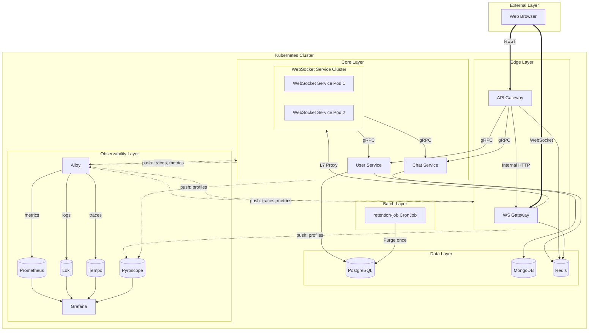

# Go Chat MSA

Go로 구현한 채팅 웹 애플리케이션입니다.
MSA 구조로 REST, gRPC, WebSocket 서비스를 분리했고, Kubernetes dev/test 환경에서 실행과 검증을 수행합니다.

- 6개 서비스가 REST, gRPC, WebSocket으로 통신
- 채팅방 기반 라우팅으로 WebSocket 노드 분배
- Grafana 스택으로 로그, 메트릭, 트레이스, 프로파일 통합 관측
- K8s `test` overlay에서 fixed replicas 멀티 인스턴스 e2e 검증
- k6 부하테스트로 **10,000 동시접속, 메시지 P99 레이턴시 25ms 이하** 검증한 legacy baseline 보유

| 분류 | 기술 |
|:---|:---|
| 언어 | Go 1.26 |
| 통신 | `net/http`, `gorilla/websocket`, `google.golang.org/grpc` |
| 데이터베이스 | PostgreSQL 17, MongoDB 8.0, Redis 7 |
| 인증 | `golang-jwt/jwt/v5` (HS256), `golang.org/x/crypto` (Bcrypt), Redis TTL Refresh Token Rotation |
| 부하분산 | `buraksezer/consistent` (Consistent Hashing) |
| 관측성 | OpenTelemetry, Grafana, Prometheus, Loki, Tempo, Pyroscope |
| 코드 생성 | Buf (Protobuf), sqlc (SQL), mockery (Mock) |
| 테스트 | `stretchr/testify`, K8s e2e, `testcontainers-go` (통합 테스트) |
| 인프라 | Kubernetes, Kustomize, kind, Docker image build/load |

### 스크린샷

> [!NOTE]
> 프론트엔드는 데모 목적으로 작성되었으며, 백엔드 설계와 구현에 초점을 맞춘 프로젝트입니다.

| 로비 | 채팅 |
|:---:|:---:|
|  |  |

---

## 실행 방법

로컬 Kubernetes는 `kind` 기준으로 실행합니다. Docker는 Compose 실행용이 아니라 이미지 빌드와 kind image load 용도로 사용합니다.

### 1. kind 클러스터 생성

```bash
kind create cluster --name go-chat --config deploy/k8s/clusters/kind-dev.yaml

kubectl apply -f https://raw.githubusercontent.com/kubernetes/ingress-nginx/controller-v1.15.1/deploy/static/provider/kind/deploy.yaml
kubectl -n ingress-nginx patch deployment ingress-nginx-controller \
  --type=merge \
  -p '{"spec":{"template":{"spec":{"nodeSelector":{"kubernetes.io/os":"linux","ingress-ready":"true"}}}}}'
kubectl wait --namespace ingress-nginx \
  --for=condition=ready pod \
  --selector=app.kubernetes.io/component=controller \
  --timeout=120s
```

### 2. dev overlay

`dev`는 로컬 개발 smoke 환경입니다. app 서비스는 단일 인스턴스로 실행합니다.

```bash
for service in api-gateway ws-gateway websocket-service user-service chat-service retention-job; do
  docker build --build-arg SERVICE_NAME="${service}" -t "go-chat-msa/${service}:dev" .
  kind load docker-image --name go-chat "go-chat-msa/${service}:dev"
done

docker build -t go-chat-msa/frontend:dev ./frontend
kind load docker-image --name go-chat go-chat-msa/frontend:dev

K8S_ENV=dev NAMESPACE=go-chat-dev bash deploy/k8s/scripts/bootstrap.sh
```

Ingress는 kind host port `30080`으로 노출됩니다.

| 서비스 | URL |
|:---|:---|
| 프론트엔드 | http://localhost:30080/ |
| API Gateway health | http://localhost:30080/api/health |
| WS Gateway health | http://localhost:30080/ws-api/health |

Grafana는 port-forward로 접근합니다.

```bash
kubectl -n go-chat-dev port-forward svc/grafana 3000:3000
```

### 3. test overlay와 e2e

`test`는 자동화된 correctness gate입니다. app 서비스는 fixed replicas 2로 실행하고, e2e는 이 K8s namespace를 대상으로만 동작합니다.

```bash
for service in api-gateway ws-gateway websocket-service user-service chat-service retention-job; do
  docker build --build-arg SERVICE_NAME="${service}" -t "go-chat-msa/${service}:test" .
  kind load docker-image --name go-chat "go-chat-msa/${service}:test"
done

docker build -t go-chat-msa/frontend:test ./frontend
kind load docker-image --name go-chat go-chat-msa/frontend:test

K8S_ENV=test NAMESPACE=go-chat-test bash deploy/k8s/scripts/bootstrap.sh
go test -count=1 -tags e2e ./test/e2e
```

e2e endpoint는 필요하면 override할 수 있습니다.

```bash
E2E_GATEWAY_BASE_URL=http://localhost:30080/api \
E2E_WS_BASE_URL=http://localhost:30080/ws-api \
E2E_K8S_NAMESPACE=go-chat-test \
go test -count=1 -tags e2e ./test/e2e
```

### 4. retention CronJob smoke

`retention-job` CronJob은 기본적으로 `suspend: true`입니다. schedule을 열기 전 smoke는 CronJob 템플릿으로 one-shot Job을 만들어 확인합니다.

```bash
NAMESPACE=go-chat-test bash deploy/k8s/scripts/retention-cronjob-smoke.sh
```

---

## 아키텍처


```mermaid
flowchart TB
    subgraph External ["External Layer"]
        direction LR
        Client["Web Browser"]
    end

    subgraph K8s ["Kubernetes Cluster"]
        subgraph Edge ["Edge Layer"]
            direction LR
            WSGW["WS Gateway"]
            AGW["API Gateway"]

            AGW -- "Internal HTTP" --> WSGW
        end

        subgraph Core ["Core Layer"]
            direction LR
            subgraph WS_Cluster ["WebSocket Service Cluster"]
                direction LR
                WSS1["WebSocket Service Pod 1"]
                WSS2["WebSocket Service Pod 2"]
            end
            US["User Service"]
            CS["Chat Service"]
        end

        subgraph Jobs ["Batch Layer"]
            RJ["retention-job CronJob"]
        end

        subgraph Data ["Data Layer"]
            direction LR
            PG[("PostgreSQL")]
            MG[("MongoDB")]
            RD[("Redis")]
        end

        subgraph Observability ["Observability Layer"]
            direction LR
            Alloy["Alloy"]
            Prometheus[("Prometheus")]
            Loki[("Loki")]
            Tempo[("Tempo")]
            Pyroscope[("Pyroscope")]
            Grafana["Grafana"]

            Alloy -- "metrics" --> Prometheus
            Alloy -- "logs" --> Loki
            Alloy -- "traces" --> Tempo
            Prometheus & Loki & Tempo & Pyroscope --> Grafana
        end
    end

    Client == "WebSocket" ==> WSGW
    Client == "REST" ==> AGW

    WSGW -- "L7 Proxy" --> WS_Cluster

    AGW -- "gRPC" --> US
    AGW -- "gRPC" --> CS

    WS_Cluster -- "gRPC" --> US
    WS_Cluster -- "gRPC" --> CS

    US --> PG
    US --> RD
    CS --> MG
    AGW --> RD
    WSGW --> RD
    RJ -- "Purge once" --> PG

    Alloy -. "pull: logs" .-> Edge
    Alloy -. "pull: logs" .-> Core
    Edge -. "push: traces, metrics" .-> Alloy
    Core -. "push: traces, metrics" .-> Alloy
    Edge -. "push: profiles" .-> Pyroscope
    Core -. "push: profiles" .-> Pyroscope
```

| 서비스 | 역할 | 프로토콜 | 저장소 |
|:---|:---|:---|:---|
| api-gateway | REST API 진입점, 인증 위임, 버전 라우팅 | REST | Redis |
| ws-gateway | WebSocket L7 리버스 프록시, Consistent Hashing | HTTP | Redis |
| websocket-service | 실시간 메시지 브로드캐스트, 세션/룸 관리 | WebSocket | - |
| user-service | 사용자 및 채팅방 CRUD, Bcrypt 워커 풀, refresh token 상태 관리 | gRPC | PostgreSQL, Redis |
| chat-service | 메시지 저장 및 조회 | gRPC | MongoDB |
| retention-job | 소프트 삭제된 채팅방/사용자 one-shot purge | CronJob | PostgreSQL |

상세 흐름은 개별 다이어그램을 참고해 주세요.

- [메시지 브로드캐스트 흐름](docs/diagrams/flow-message.mmd)
- [WebSocket 라우팅 흐름](docs/diagrams/flow-ws-routing.mmd)
- [인증 및 티켓 발급 시퀀스](docs/diagrams/seq-auth-ticket.mmd)
- [WebSocket 세션 생명주기](docs/diagrams/seq-websocket.mmd)

---

## 주요 설계 결정

상세 설계는 [DESIGN.md](docs/DESIGN.md)를 참고해 주세요.

1. **Bcrypt 워커 풀 - CPU 경합 방지**: 무제한 고루틴 대신 CPU 코어수의 워커로 동시성을 제한하여 CPU 바운드 작업 효율성을 높였습니다. 대기열이 꽉 차면 즉시 거부해서 연쇄 장애를 막습니다.

2. **채팅방 기반 라우팅 - WebSocket 분배**: Redis Pub/Sub으로 노드 간 중계하는 대신, 동일 채팅방의 모든 세션을 한 노드에 모아 인메모리 브로드캐스트합니다. 외부 인프라 병목을 줄이고, 네트워크 RTT를 없애 성능을 높였습니다.

3. **Actor 모델 - WebSocket 계층 분리**: Router, Manager, Hub, Session 4계층으로 나누고, Manager와 Hub는 각각 단일 고루틴의 `select` 루프에서 상태를 순차 처리합니다. 외부와는 채널로만 통신하기 때문에 뮤텍스 없이 동시성 안전합니다.

4. **Kubernetes CronJob - scheduled job 책임 분리**: serving Deployment 안에서 주기 작업을 실행하지 않고, one-shot entrypoint를 CronJob 템플릿으로 실행합니다. replica 수와 batch 실행 횟수가 결합되지 않도록 분리했습니다.

---

## 관측성

OpenTelemetry SDK로 계측하고 Grafana 스택으로 4가지 신호를 통합 조회합니다.
상세 계측 항목은 [텔레메트리 카탈로그](docs/TELEMETRY_CATALOG.md)를 참고해 주세요.

| 신호 | 백엔드 | 용도 |
|:---|:---|:---|
| 로그 | Loki | 이슈 발생 확인, 트레이스 연결 |
| 메트릭 | Prometheus | HTTP, gRPC, DB, WebSocket 지표 수집 |
| 트레이스 | Tempo | 서비스 간 요청 흐름 추적 |
| 프로파일 | Pyroscope | CPU, 메모리, 고루틴 병목 분석 |

### Grafana


---

## 테스트

| 구분 | 실행 명령어 | 설명 |
|:---|:---|:---|
| 단위 | `go test ./...` | 테이블 기반, `t.Parallel()` 병렬 실행 |
| 통합 | `go test -tags integration ./...` | Testcontainers로 실제 DB 사용, 서비스 단위 시나리오 검증 |
| E2E | `go test -count=1 -tags e2e ./test/e2e` | K8s `test` overlay 대상 blackbox 및 멀티 인스턴스 정합성 검증 |
| CronJob smoke | `NAMESPACE=go-chat-test bash deploy/k8s/scripts/retention-cronjob-smoke.sh` | suspended CronJob 템플릿에서 one-shot Job 생성 |

### k6 부하테스트 결과

10,000 동시접속 / 100개 방 / 2K Ingress, 200K Egress RPS 환경에서 모든 임계값을 통과했습니다(네트워크 RTT 제외).
이 수치는 Kubernetes 이관 전 legacy baseline이며, Compose 기준점은 `legacy-compose-baseline` tag로 보존합니다.
Phase 3에서는 멀티 노드 K8s 환경에서 HPA, rollout/drain, P99, 메시지 정합성을 다시 측정합니다.

상세 분석은 [C10K 보고서](docs/C10K_REPORT.md)와 [트러블슈팅 기록](docs/C10K_TROUBLESHOOTING.md)을 참고해 주세요.

| 메트릭 | 임계값 | 결과 (P99) |
|:---|:---|:---|
| 메시지 지연 | < 50ms | 19 ~ 25ms |
| 히스토리 조회 | < 100ms | 10 ~ 12ms |
| 동기화 조회 | < 100ms | 15 ~ 19ms |
| 메시지 타임아웃 | < 1건 | 0건 |
