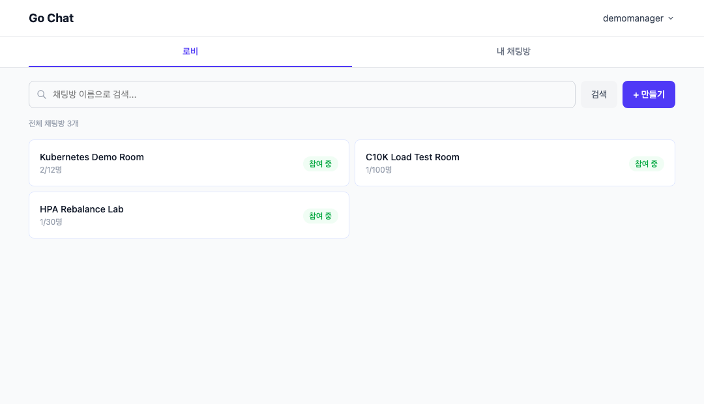
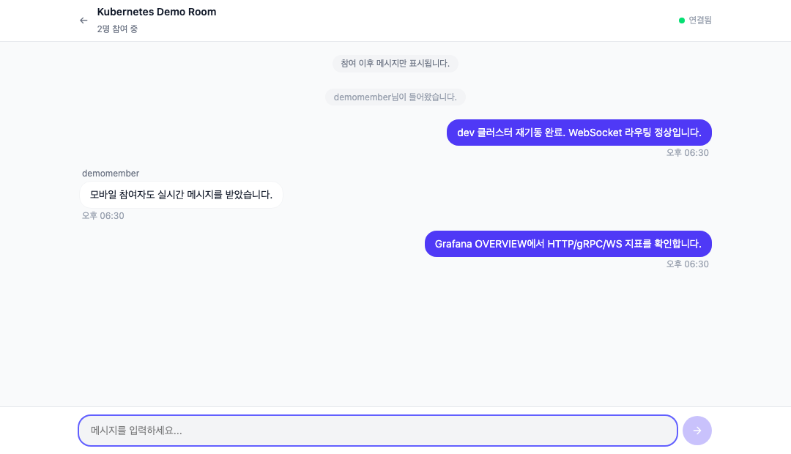
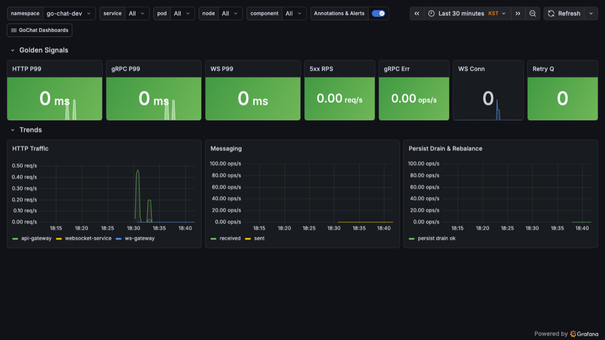
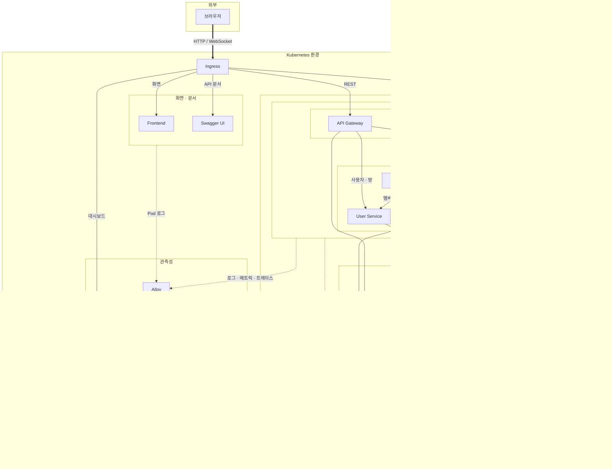

# Go Chat MSA

Go로 만든 MSA 채팅 서버이며, 빠른 메시지 분배를 목표로 합니다.  
Kubernetes 위에서 동작하며, 웹소켓 서비스의 수평 확장 상황에서도 메시지 순서 정합성을 보장합니다.  
관측성 확보를 위해 OpenTelemetry 기반 Grafana 스택을 도입했습니다.

- 5개의 서비스가 REST · gRPC · WebSocket으로 통신
- 채팅방 ID 기반 Consistent Hashing으로 WebSocket 라우팅
- Redis Pub/Sub 없이 인메모리 브로드캐스트로 빠르게 메시지 분배
- 웹소켓 서비스 목록, 방 소유권 등의 제어 상태로 HPA 중 메시지 순서 보장
- OTel 기반 Grafana 스택으로 로그 · 메트릭 · 트레이스 · 프로파일 통합 관측
- k6 부하 테스트로 10,000명 동시 접속, 2K Ingress, 200K Egress 환경에서 메시지 P99 레이턴시 43ms 달성

## 스크린샷

> [!NOTE]
> 프론트엔드는 데모 목적으로 작성되었으며, 백엔드 설계와 구현에 초점을 맞춘 프로젝트입니다.

| 로비 | 채팅방 |
| :---: | :---: |
|  |  |

| Grafana 대시보드 |
| :---: |
|  |

## 실행 방법

애플리케이션 실행을 위해 아래 요소를 설치해야 합니다.

| 필수 설치 | 용도 |
| :--- | :--- |
| Docker | 이미지 빌드와 kind 노드 실행 |
| kind | 로컬 Kubernetes 클러스터 생성 |
| kubectl | K8s 리소스 적용과 상태 확인 |
| Go | 백엔드 서비스 빌드 |
| Make | 실행 명령 단순화 |

설치 후 아래 명령어로 K8s 클러스터와 애플리케이션을 함께 실행할 수 있습니다.

```bash
make dev-up
```

| 서비스 | URL |
| :--- | :--- |
| 프론트엔드 | http://dev.gochat.localhost:30080/ |
| Swagger UI | http://dev.gochat.localhost:30080/docs/ |
| Grafana | http://dev.gochat.localhost:30080/grafana/ |

## 아키텍처


```mermaid
flowchart TB
    subgraph External ["외부"]
        direction LR
        Client["브라우저"]
    end

    subgraph K8s ["Kubernetes 환경"]
        direction TB

        Ingress["Ingress"]

        subgraph PublicUI ["화면 · 문서"]
            direction LR
            FE["Frontend"]
            Docs["Swagger UI"]
        end

        subgraph Runtime ["서비스 런타임"]
            direction TB

            subgraph Services ["애플리케이션 서비스"]
                direction TB

                subgraph Gateway ["진입 계층"]
                    direction LR
                    AGW["API Gateway"]
                    WSGW["WS Gateway"]
                end

                subgraph Domain ["도메인 계층"]
                    direction LR
                    US["User Service"]
                    CS["Chat Service"]
                    WSS["WebSocket Service"]
                end
            end

            subgraph State ["상태 저장소"]
                direction LR

                subgraph Data ["영속 저장소"]
                    direction LR
                    PG[("PostgreSQL")]
                    MG[("MongoDB")]
                end

                subgraph Control ["제어 상태 저장소"]
                    direction LR
                    RD[("Redis")]
                end
            end
        end

        subgraph Observability ["관측성"]
            direction LR
            Alloy["Alloy"]
            Prometheus[("Prometheus")]
            Loki[("Loki")]
            Tempo[("Tempo")]
            Pyroscope[("Pyroscope")]
            Grafana["Grafana"]
        end

        subgraph Verification ["검증 리소스"]
            direction LR
            Load["C10K k6 Job"]
            HPAProbe["HPA k6 Job"]
        end
    end

    Client == "HTTP / WebSocket" ==> Ingress
    Ingress -- "화면" --> FE
    Ingress -- "REST" --> AGW
    Ingress -- "WebSocket" --> WSGW
    Ingress -- "API 문서" --> Docs
    Ingress -- "대시보드" --> Grafana

    AGW -- "사용자 · 방" --> US
    AGW -- "메시지 조회" --> CS
    WSGW -- "방 기준 라우팅" --> WSS
    WSS -- "멤버십 확인" --> US
    WSS -- "메시지 저장 · 순번 조회" --> CS

    US --> PG
    US --> RD
    CS --> MG
    AGW --> RD
    WSGW --> RD
    WSS --> RD
    MG ~~~ RD

    PublicUI -. "Pod 로그" .-> Alloy
    Services -. "로그 · 메트릭 · 트레이스" .-> Alloy
    Services -. "프로파일" .-> Pyroscope
    Alloy --> Prometheus
    Alloy --> Loki
    Alloy --> Tempo
    Prometheus --> Grafana
    Loki --> Grafana
    Tempo --> Grafana
    Pyroscope --> Grafana
```

| 서비스 | 책임 | 통신 | 상태/저장소 |
| :--- | :--- | :--- | :--- |
| `api-gateway` | REST API 진입점, JWT 검증 | HTTP | Redis |
| `ws-gateway` | WebSocket 티켓 발급 및 라우팅 | HTTP/WebSocket | Redis |
| `websocket-service` | 세션 관리, 메시지 브로드캐스트 | WebSocket | Redis |
| `user-service` | 사용자, 채팅방, refresh token 관리 | gRPC | PostgreSQL, Redis |
| `chat-service` | 메시지 저장, 조회 | gRPC | MongoDB |

상세 흐름은 다이어그램으로 분리했습니다.

| 다이어그램 | 내용 |
| :--- | :--- |
| [Kubernetes 실행 아키텍처](docs/diagrams/flow-k8s-architecture.mmd) | Ingress, 서비스, 데이터 계층, 관측성 구성 |
| [멤버십 싱크](docs/diagrams/seq-membership-sync.mmd) | Redis 후보 목록 변경과 해시 링 갱신 |
| [소유권 이전](docs/diagrams/seq-ownership-transfer.mmd) | HPA 확장 중 담당 인스턴스 이전과 종료 절차 |
| [메시지 처리 흐름](docs/diagrams/flow-message.mmd) | WebSocket 메시지 수신, 순번 부여, 브로드캐스트, 저장 |

## 주요 설계 결정

### WebSocket 라우팅

WebSocket 메시지는 같은 방의 세션을 한 WebSocket Service 인스턴스로 모아 브로드캐스트합니다.  
메시지마다 Redis Pub/Sub를 거치지 않고, WS Gateway가 `room_id` 기반 consistent hashing으로 대상 인스턴스를 고릅니다.

이 구조의 목적은 메시지 분배 지연을 낮추고 중앙 병목을 피하는 것입니다.  
방 단위 브로드캐스트와 순번 부여는 담당 WebSocket Service 인스턴스의 로컬 메모리에서 처리하고, Redis는 라우팅 후보 목록과 방 소유권 같은 제어 상태만 맡습니다.  
여기서 방 소유권은 특정 방을 현재 어느 인스턴스가 처리하는지를 뜻합니다.  

WebSocket Service 인스턴스는 Redis에 자기 주소를 `POD_IP:PORT` 형식으로 등록합니다.  
Service VIP를 거치면 consistent hashing이 고른 담당 인스턴스가 Kubernetes Service 로드밸런싱으로 다시 바뀔 수 있기 때문입니다.  

WS Gateway는 Redis의 후보 키 변화를 감지해 해시 링을 갱신합니다.  
Keyspace notification은 변경 신호로 사용하고, 실제 후보 목록은 `SCAN wss:member:*`로 다시 읽습니다.  
30초 주기 재검사도 함께 둬 이벤트를 놓쳐도 Redis에 남아 있는 후보 목록으로 해시 링을 다시 맞춥니다.  

### 분산 라우팅 정합성

WS Gateway와 WebSocket Service의 각 인스턴스는 Redis 후보 목록을 관찰해 자기 로컬 해시 링을 갱신합니다.  
하지만 모든 인스턴스가 같은 순간에 같은 목록을 보는 것은 아닙니다.  
그래서 WS Gateway의 해시 링과 WebSocket Service의 해시 링이 일시적으로 다를 수 있다는 전제로 방어합니다.  

| 상황 | 처리 | 이유 |
| :--- | :--- | :--- |
| 잘못된 담당 인스턴스로 라우팅 | WebSocket Service가 421 응답, WS Gateway가 503으로 변환 | 오래된 라우팅 정보를 빠르게 드러내고 클라이언트가 새 담당 인스턴스로 다시 연결 |
| 새 Hub 생성 | WebSocket upgrade 전에 방 소유권 획득 및 순번 초기화 | 소켓을 열기 전에 담당 인스턴스와 순번 기준을 확정 |
| 담당 인스턴스 변경 | 저장 대기 작업 완료 후 방 소유권 반납 | 새 담당 인스턴스가 이전 저장 완료 전에 순번을 시작하지 않게 함 |
| 방 소유권 갱신 실패 | 토큰 불일치나 키 없음은 즉시 Hub 종료, Redis 오류는 마지막 성공 갱신 후 20초 초과 시 Hub 종료 | 일시 오류는 흡수하되 소유권이 불확실해진 상태에서는 메시지 수신 차단 |

담당 인스턴스 변경은 멤버십 변경 이벤트를 받으면 바로 검사하고, 기존 Hub는 0~2초 무작위 지연 후 종료 절차에 들어갑니다.  
이벤트를 놓친 경우에도 Manager가 10초마다 자신이 가진 Hub의 담당 여부를 다시 확인하므로, 최대 약 12초 안에 종료 절차가 시작됩니다.  
이후 Hub는 이미 브로드캐스트한 메시지의 저장 완료를 기다린 뒤 방 소유권을 반납합니다.  

WebSocket 연결 라우팅 실패에 대해서는 WS Gateway나 WebSocket Service가 다른 인스턴스로 서버 측 재시도를 하지 않습니다.  
연결 재시도는 클라이언트가 무작위 지연을 섞어 수행하게 해 재시도 트래픽이 한 번에 몰리지 않게 합니다.  

### WebSocket 계층 구조

WebSocket Service는 연결 수명, 방 소유권, 세션 목록, 브로드캐스트, 저장 요청을 함께 다룹니다.  
이 책임을 한 계층에 모으면 상태 변경 순서를 추적하기 어려워지므로 Router, Manager, Hub, Session으로 나눴습니다.  
의존 방향은 위에서 아래로만 흐르게 제한했습니다.  

```text
Router (1)
└── Manager (1)
    ├── Hub (채팅방 A)
    │   ├── Session (유저 1)
    │   └── Session (유저 2)
    └── Hub (채팅방 B)
        └── Session (유저 3)
```

Manager와 Hub는 액터 모델로 동시성을 처리합니다.  
Manager는 Hub 목록과 생명주기를 단일 `select` 루프에서 관리하고, Hub는 세션 목록, 순번 부여, 브로드캐스트를 자기 루프에서 순서대로 처리합니다.  
외부와는 채널 또는 주입된 함수로만 통신해 공유 상태를 직접 잠그는 범위를 줄였습니다.  
다만 Hub가 종료 절차에 들어간 뒤 새 메시지가 `broadcastCh`에 들어가지 않도록 `RWMutex`와 atomic flag로 수신 경계를 닫습니다.

| 계층 | 책임 |
| :--- | :--- |
| Router | HTTP 요청을 검증하고 WebSocket upgrade 전까지의 준비 절차를 조율 |
| Manager | Hub 생성과 종료, 방 소유권, 저장 파이프라인을 관리 |
| Hub | 한 방의 세션 목록, 순번 부여, 브로드캐스트를 직렬 처리 |
| Session | 개별 WebSocket 연결의 읽기/쓰기와 메시지 검증을 담당 |

자식 계층이 부모를 직접 참조하면 순환 의존이 생깁니다.  
부모의 작업 큐로 넘기는 일은 송신 전용 채널로, 호출한 자리에서 바로 결과가 필요한 일은 콜백 함수로 분리했습니다.

### 비동기 배치 저장

메시지를 브로드캐스트와 동시에 저장하면 저장 지연이 실시간 전송 경로에 직접 영향을 줍니다.  
이를 방지하기 위해 실시간 분배와 저장을 분리하고, 저장은 배치 워커에서 비동기로 처리합니다.

저장 작업 큐가 꽉 찬 경우, 메시지 브로드캐스트를 수행하지 않습니다.  
Hub는 `persistCh`에 작업을 넣기 전에 같은 크기의 버퍼드 채널을 세마포어처럼 사용해 저장 큐에 등록할 수 있는지 먼저 확인합니다.  
등록 가능할 때만 순번을 부여하고, 저장 작업을 `persistCh`에 넣은 다음 브로드캐스트합니다.  
저장 경로가 꽉 차 있거나 중간 단계에서 실패하면 순번과 예약을 되돌리고 메시지를 보낸 세션에 일시 오류를 반환합니다.  

저장 워커는 채널에서 작업을 꺼내 일정 건수 또는 타이머 기준으로 배치 저장합니다.  
메시지 순서는 Hub에서 부여하므로 DB 저장 순서가 달라져도 메시지 순서는 유지됩니다.  
이미 저장된 메시지는 성공으로 보고, 재시도 가능한 오류만 재시도 큐로 보냅니다.  

이 구조는 브로드캐스트 지연을 낮추지만, 저장 실패와 재시도가 길어지면 Hub 종료가 늦어질 수 있습니다.  
서버 종료나 방 담당 인스턴스 변경 시 Hub는 이미 브로드캐스트한 메시지의 저장 완료를 기다리지만,  
무한히 대기하지 않도록 `shutdown_timeout`을 지정하고 타임아웃 발생 시 메트릭과 로그를 남기고 종료합니다.

### bcrypt 워커 풀

bcrypt는 무차별 대입을 어렵게 만들기 위해 의도적으로 느리게 동작하는 CPU 바운드 해시 알고리즘입니다.  
DB나 네트워크 I/O는 응답을 기다리는 동안 고루틴이 block되어 다른 고루틴이 CPU를 사용할 수 있지만, bcrypt는 실행되는 동안 CPU를 계속 사용합니다.  
Go 런타임이 동시에 실행할 수 있는 Go 코드는 `GOMAXPROCS` 범위로 제한되므로, CPU 바운드 작업은 많이 시작한다고 처리량이 그만큼 늘지 않고 오히려 스케줄링 비용만 증가합니다.

가입이나 로그인 요청이 몰릴 때 모든 요청 고루틴이 bcrypt를 바로 수행하면, 코어 수보다 많은 해싱 작업이 한정된 CPU 시간을 나눠 갖습니다.  
작업 하나가 빨리 끝나기보다 여러 작업이 동시에 조금씩 진행되면서 대기열이 길어집니다.  
이 상태가 길어지면 인증 요청뿐만 아니라 같은 인스턴스의 다른 요청도 함께 밀립니다.

이를 방지하기 위해 bcrypt 연산에는 워커 풀 패턴을 도입했습니다.  
워커 수는 `runtime.GOMAXPROCS(0)` 기준으로 두어 동시에 실행되는 해싱 수를 실제 병렬 실행 폭에 맞춥니다.  
짧은 순간의 요청 증가는 제한된 큐로 흡수하되, 큐가 가득 차면 더 기다리게 하지 않고 `ErrQueueFull`을 반환합니다.  

이는 일부 요청을 빠르게 실패시키는 대신, CPU 경합이 user-service 인스턴스 전체로 번지는 것을 막기 위한 것입니다.  
user-service는 `ErrQueueFull`을 `ResourceExhausted`로 바꿔 gateway가 과부하 응답을 낼 수 있게 합니다.  
과부하를 서버 내부에 숨기지 않고 빠르게 클라이언트에게 알리며, 관측 가능한 지표로 남기는 것이 목적입니다.

## 관측성

관측성을 확보하여 장애 원인을 빠르게 찾고, 병목 지점을 확인하여 시스템을 지속적으로 개선했습니다.  
메트릭으로 이상 범위를 잡고, 트레이스와 로그로 요청 맥락을 확인합니다.  
프로파일은 코드 레벨 병목을 볼 때 사용합니다.

계측은 OTel SDK와 Grafana 스택으로 통일했습니다.  
Alloy는 로그, 메트릭, 트레이스를 수집합니다.  
프로파일은 앱 SDK가 Pyroscope로 직접 전송합니다.

| 신호 | 백엔드 | 용도 |
| :--- | :--- | :--- |
| 로그 | Loki | 이벤트 기록 검색, `trace_id` 기준 요청 추적 |
| 메트릭 | Prometheus | API 레이턴시, 오류율, WebSocket 지표 확인 |
| 트레이스 | Tempo | HTTP/gRPC/Redis/DB 호출 흐름 추적 |
| 프로파일 | Pyroscope | CPU 사용과 코드 병목 분석 |

Grafana 대시보드는 전체 상태에서 시작해 API, 실시간 메시지, 저장소, 런타임을 목적에 맞게 확인할 수 있도록 구성했습니다.

상세 계측 항목은 [텔레메트리 카탈로그](docs/TELEMETRY_CATALOG.md)에 정리했습니다.

## Kubernetes 실행 기준

K8s manifest는 `base`와 환경별 overlay로 나눴습니다.
부하 테스트는 `dev`, HPA 정합성 테스트는 `qa` overlay에서 실행합니다.
`bootstrap.sh`가 데이터 계층, 관측성, migration, 애플리케이션을 순서대로 적용합니다.

| 환경 | 주요 설정 | 검증 |
| :--- | :--- | :--- |
| `dev` | WebSocket Service 2 replicas | C10K 부하 테스트 |
| `qa` | WebSocket Service HPA `1→2` | HPA 전환 중 메시지 정합성 |

### 검증 명령

```bash
make dev-up
make dev-load

make qa-up
make qa-load
```

환경에 맞는 클러스터를 띄우고 테스트를 진행할 수 있습니다.  
단, 부하 테스트는 고성능 하드웨어가 필요하므로 주의 바랍니다.

### 정리

```bash
make dev-down
make qa-down
make kind-delete
```

## 검증 결과

검증은 로컬 MacBook에서 OrbStack 위에 kind 클러스터를 띄워 수행했습니다.

- 하드웨어: MacBook M4 Pro, 14코어 CPU, 24GB 메모리
- 런타임: OrbStack 2.2.1, kind Kubernetes v1.36.1

### C10K 부하 테스트

로컬 kind `dev` 환경에서 10,000 동시 연결과 100개 방 조건의 부하를 검증했습니다.

| 항목 | 결과 |
| :--- | :--- |
| 동시 접속 | 10,000 |
| 채팅방 | 100개 |
| 방당 인원 | 100명 |
| 메시지 Ingress | 약 2K msg/s |
| 메시지 Egress | 약 200K msg/s |
| 클라이언트 메시지 P99 | 최대 43ms |
| 서버 Fanout P99 | 6.51ms |
| 서버 Egress P99 | 24.2ms |
| 메시지 timeout | 0 |

자세한 테스트 환경, 워커별 수치, CPU/메모리 분석은
[Kubernetes C10K 부하 테스트 보고서](docs/K8S_C10K_REPORT.md)에 정리했습니다.

### WebSocket HPA 정합성 테스트

로컬 kind `qa` 환경에서 `websocket-service` HPA `1→2` 전환 중 메시지 정합성을 검증했습니다.

| 항목 | 결과 |
| :--- | :--- |
| k6 작업 | `k6-hpa Complete 1/1` |
| HTTP 실패 | 0 |
| WebSocket 오류 | 0 |
| 순번 중복 | 0 |
| 순번 역전 | 0 |
| 누락 구간 감지/복구 | 2 / 2 |
| 누락 구간 미복구 | 0 |
| MongoDB 순번 공백 | 0 |
| 누락분 조회 P99 | 15.33ms |

## 더 살펴보기

| 문서 | 내용 |
| :--- | :--- |
| [DESIGN.md](docs/DESIGN.md) | 전체 설계와 트레이드오프 |
| [K8S_C10K_REPORT.md](docs/K8S_C10K_REPORT.md) | K8s `dev-load` C10K 부하 테스트 결과 |
| [TELEMETRY_CATALOG.md](docs/TELEMETRY_CATALOG.md) | 로그/메트릭/트레이스/프로파일 카탈로그 |
| [DOCKER_C10K_REPORT.md](docs/DOCKER_C10K_REPORT.md) | Docker Compose C10K 성능 기준 |
| [DOCKER_C10K_TROUBLESHOOTING.md](docs/DOCKER_C10K_TROUBLESHOOTING.md) | Docker Compose C10K 병목과 해결 기록 |

| 다이어그램 | 내용 |
| :--- | :--- |
| [Kubernetes 실행 아키텍처](docs/diagrams/flow-k8s-architecture.mmd) | Ingress, 서비스, 데이터 계층, 관측성 구성 |
| [로그인과 WebSocket 인증](docs/diagrams/seq-auth-ticket.mmd) | 로그인, refresh token, WebSocket 티켓 발급 |
| [WebSocket 연결](docs/diagrams/seq-websocket.mmd) | 티켓 검증, 담당 인스턴스 확인, Hub 등록 |
| [멤버십 싱크](docs/diagrams/seq-membership-sync.mmd) | Redis 후보 목록 변경과 해시 링 갱신 |
| [소유권 이전](docs/diagrams/seq-ownership-transfer.mmd) | HPA 확장 중 담당 인스턴스 이전과 종료 절차 |
| [메시지 처리 흐름](docs/diagrams/flow-message.mmd) | WebSocket 메시지 수신, 순번 부여, 브로드캐스트, 저장 |

Docker Compose는 더 이상 기본 실행 경로가 아닙니다.  
K8s 전환 전 C10K 기준점은 `legacy-compose-baseline` 태그와 Docker Compose 문서로 남겼습니다.
