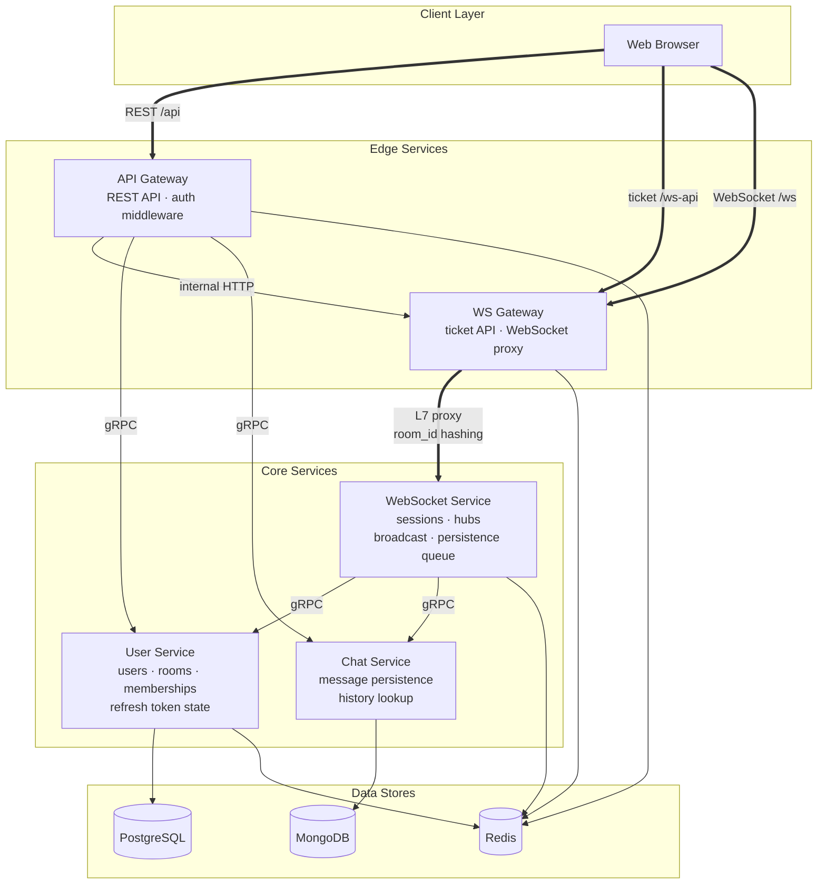

# Go Chat MSA

Go로 구현한 채팅 웹 애플리케이션입니다.
MSA 구조로 REST, gRPC, WebSocket 서비스를 분리했고, Kubernetes dev/test 환경에서 실행과 검증을 수행합니다.

- 6개 서비스가 REST, gRPC, WebSocket으로 통신
- 채팅방 기반 라우팅으로 WebSocket 노드 분배
- Grafana 스택으로 로그, 메트릭, 트레이스, 프로파일 통합 관측
- K8s `test` overlay에서 fixed replicas 멀티 인스턴스 e2e 검증
- k6 부하테스트로 **10,000 동시접속, 메시지 P99 레이턴시 25ms 이하** 검증한 legacy baseline 보유

| 분류 | 기술 |
|:---|:---|
| 언어 | Go 1.26 |
| 통신 | `net/http`, `gorilla/websocket`, `google.golang.org/grpc` |
| 데이터베이스 | PostgreSQL 17, MongoDB 8.0, Redis 7 |
| 인증 | `golang-jwt/jwt/v5` (HS256), `golang.org/x/crypto` (Bcrypt), Redis TTL Refresh Token Rotation |
| 부하분산 | `buraksezer/consistent` (Consistent Hashing) |
| 관측성 | OpenTelemetry, Grafana, Prometheus, Loki, Tempo, Pyroscope |
| 코드 생성 | Buf (Protobuf), sqlc (SQL), mockery (Mock) |
| 테스트 | `stretchr/testify`, K8s e2e, `testcontainers-go` (통합 테스트) |
| 인프라 | Kubernetes, Kustomize, kind, Docker image build/load |

### 스크린샷

> [!NOTE]
> 프론트엔드는 데모 목적으로 작성되었으며, 백엔드 설계와 구현에 초점을 맞춘 프로젝트입니다.

| 로비 | 채팅 |
|:---:|:---:|
|  |  |

---

## 실행 방법

로컬 Kubernetes는 `kind` 기준으로 실행합니다. Docker는 Compose 실행용이 아니라 이미지 빌드와 kind image load 용도로 사용합니다.

### Prerequisites

아래 소프트웨어가 필요합니다.

| Software | Purpose |
|:---|:---|
| Docker | 이미지 빌드와 kind image load |
| kind | 로컬 Kubernetes 클러스터 실행 |
| kubectl | Kubernetes 리소스 적용 및 조회 |
| Go | 테스트 실행 |
| Make | 로컬 실행 명령 단순화 |

권장 로컬 사양은 CPU 4코어, 메모리 8GB 이상입니다. `dev`와 `test`를 동시에 띄우거나 e2e를 반복 실행할 경우 메모리 16GB 이상이 안정적입니다.

> [!NOTE]
> `kind`는 운영용 클러스터가 아니라 로컬에서 Kubernetes manifest, Ingress, migration Job, e2e 흐름을 재현하기 위한 개발 및 검증 환경입니다.

### 앱 실행

프론트 화면을 확인하려면 `dev` 환경을 실행합니다. 앱 서비스는 단일 인스턴스로 실행됩니다.

```bash
make dev-up
```

`make dev-up`은 다음 작업을 순서대로 수행합니다.

1. kind 클러스터 생성
2. ingress-nginx 설치
3. 서비스 이미지 빌드
4. kind 클러스터로 이미지 load
5. `dev` overlay bootstrap
6. 주요 Deployment rollout 대기

Ingress는 kind host port `30080`으로 노출됩니다. 실행이 끝나면 브라우저에서 아래 URL에 접속할 수 있습니다.

| 서비스 | URL |
|:---|:---|
| 프론트엔드 | http://dev.gochat.localhost:30080/ |
| API Gateway health | http://dev.gochat.localhost:30080/api/health |
| WS Gateway health | http://dev.gochat.localhost:30080/ws-api/health |
| Grafana | http://dev.gochat.localhost:30080/grafana/ |
| OpenAPI 문서 | http://dev.gochat.localhost:30080/docs/ |

### E2E 테스트

E2E는 `test` 환경을 먼저 띄운 뒤 `go test`로 실행합니다. 주요 앱 서비스는 2개씩 실행되어 멀티 인스턴스 상태를 검증합니다.

```bash
make test-up
go test -count=1 -tags=e2e ./test/e2e
```

### 정리

```bash
make dev-down
make test-down
make kind-delete
```

---

## 아키텍처


```mermaid
flowchart TB
    subgraph ClientLayer ["Client Layer"]
        direction LR
        Browser["Web Browser"]
    end

    subgraph Edge ["Edge Services"]
        direction LR
        AGW["API Gateway<br/>REST API · auth middleware"]
        WSGW["WS Gateway<br/>ticket API · WebSocket proxy"]
    end

    subgraph Core ["Core Services"]
        direction LR
        UserSvc["User Service<br/>users · rooms · memberships<br/>refresh token state"]
        ChatSvc["Chat Service<br/>message persistence<br/>history lookup"]
        WSSvc["WebSocket Service<br/>sessions · hubs<br/>broadcast · persistence queue"]
    end

    subgraph Data ["Data Stores"]
        direction LR
        PG[("PostgreSQL")]
        MG[("MongoDB")]
        RD[("Redis")]
    end

    Browser == "REST /api" ==> AGW
    Browser == "ticket /ws-api" ==> WSGW
    Browser == "WebSocket /ws" ==> WSGW

    AGW -- "internal HTTP" --> WSGW
    WSGW == "L7 proxy<br/>room_id hashing" ==> WSSvc

    AGW -- "gRPC" --> UserSvc
    AGW -- "gRPC" --> ChatSvc
    WSSvc -- "gRPC" --> UserSvc
    WSSvc -- "gRPC" --> ChatSvc

    UserSvc --> PG
    UserSvc --> RD
    ChatSvc --> MG
    AGW --> RD
    WSGW --> RD
    WSSvc --> RD
```

| 서비스 | 역할 | 프로토콜 | 저장소 |
|:---|:---|:---|:---|
| api-gateway | REST API 진입점, 인증 위임, 버전 라우팅 | REST | Redis |
| ws-gateway | WebSocket L7 리버스 프록시, Consistent Hashing | HTTP | Redis |
| websocket-service | 실시간 메시지 브로드캐스트, 세션/룸 관리 | WebSocket | - |
| user-service | 사용자 및 채팅방 CRUD, Bcrypt 워커 풀, refresh token 상태 관리 | gRPC | PostgreSQL, Redis |
| chat-service | 메시지 저장 및 조회 | gRPC | MongoDB |

상세 흐름은 개별 다이어그램을 참고해 주세요.

- [MSA 앱 아키텍처](docs/diagrams/flow-msa.mmd)
- [K8s 런타임 배포 구조](docs/diagrams/flow-k8s-runtime.mmd)
- [K8s overlay 구조](docs/diagrams/flow-k8s-overlays.mmd)
- [K8s bootstrap 흐름](docs/diagrams/flow-k8s-bootstrap.mmd)
- [메시지 브로드캐스트 흐름](docs/diagrams/flow-message.mmd)
- [WebSocket 라우팅 흐름](docs/diagrams/flow-ws-routing.mmd)
- [인증 및 티켓 발급 시퀀스](docs/diagrams/seq-auth-ticket.mmd)
- [Refresh Token rotation 시퀀스](docs/diagrams/seq-refresh-token-rotation.mmd)
- [WebSocket 세션 생명주기](docs/diagrams/seq-websocket.mmd)

---

## 주요 설계 결정

상세 설계는 [DESIGN.md](docs/DESIGN.md)를 참고해 주세요.

1. **Bcrypt 워커 풀 - CPU 경합 방지**: 무제한 고루틴 대신 CPU 코어수의 워커로 동시성을 제한하여 CPU 바운드 작업 효율성을 높였습니다. 대기열이 꽉 차면 즉시 거부해서 연쇄 장애를 막습니다.

2. **채팅방 기반 라우팅 - WebSocket 분배**: Redis Pub/Sub으로 노드 간 중계하는 대신, 동일 채팅방의 모든 세션을 한 노드에 모아 인메모리 브로드캐스트합니다. 외부 인프라 병목을 줄이고, 네트워크 RTT를 없애 성능을 높였습니다.

3. **Actor 모델 - WebSocket 계층 분리**: Router, Manager, Hub, Session 4계층으로 나누고, Manager와 Hub는 각각 단일 고루틴의 `select` 루프에서 상태를 순차 처리합니다. 외부와는 채널로만 통신하기 때문에 뮤텍스 없이 동시성 안전합니다.

4. **Kubernetes 실행 경로 단일화**: Docker Compose 실행 경로를 제거하고 dev/test 모두 K8s overlay로 실행합니다. `dev`는 단일 인스턴스 수동 확인, `test`는 2 replicas 기반 E2E 정합성 검증에 집중합니다.

---

## 관측성

OpenTelemetry SDK로 계측하고 Grafana 스택으로 4가지 신호를 통합 조회합니다.
상세 계측 항목은 [텔레메트리 카탈로그](docs/TELEMETRY_CATALOG.md)를 참고해 주세요.

| 신호 | 백엔드 | 용도 |
|:---|:---|:---|
| 로그 | Loki | 이슈 발생 확인, 트레이스 연결 |
| 메트릭 | Prometheus | HTTP, gRPC, DB, WebSocket 지표 수집 |
| 트레이스 | Tempo | 서비스 간 요청 흐름 추적 |
| 프로파일 | Pyroscope | CPU, 메모리, 고루틴 병목 분석 |

### Grafana


---

## 테스트

통합 테스트는 K8s를 사용하지 않고 Docker 기반 Testcontainers로 필요한 DB만 띄웁니다. E2E는 K8s `test` overlay가 떠 있어야 합니다.

| 구분 | 실행 명령어 | 설명 |
|:---|:---|:---|
| 단위 | `go test ./...` | 테이블 기반, `t.Parallel()` 병렬 실행 |
| 통합 | `go test -count=1 -tags=integration ./...` | K8s 없이 Testcontainers로 실제 DB 사용 |
| E2E | `go test -count=1 -tags=e2e ./test/e2e` | K8s `test` overlay 대상 blackbox 및 멀티 인스턴스 정합성 검증 |
| 전체 | `go test -count=1 -tags=integration,e2e ./...` | 통합 테스트와 K8s e2e를 함께 실행 |

### k6 부하테스트 결과

10,000 동시접속 / 100개 방 / 2K Ingress, 200K Egress RPS 환경에서 모든 임계값을 통과했습니다(네트워크 RTT 제외).
이 수치는 Kubernetes 이관 전 legacy baseline이며, Compose 기준점은 `legacy-compose-baseline` tag로 보존합니다.
Phase 3에서는 멀티 노드 K8s 환경에서 HPA, rollout/drain, P99, 메시지 정합성을 다시 측정합니다.

상세 분석은 [C10K 보고서](docs/C10K_REPORT.md)와 [트러블슈팅 기록](docs/C10K_TROUBLESHOOTING.md)을 참고해 주세요.

| 메트릭 | 임계값 | 결과 (P99) |
|:---|:---|:---|
| 메시지 지연 | < 50ms | 19 ~ 25ms |
| 히스토리 조회 | < 100ms | 10 ~ 12ms |
| 동기화 조회 | < 100ms | 15 ~ 19ms |
| 메시지 타임아웃 | < 1건 | 0건 |
