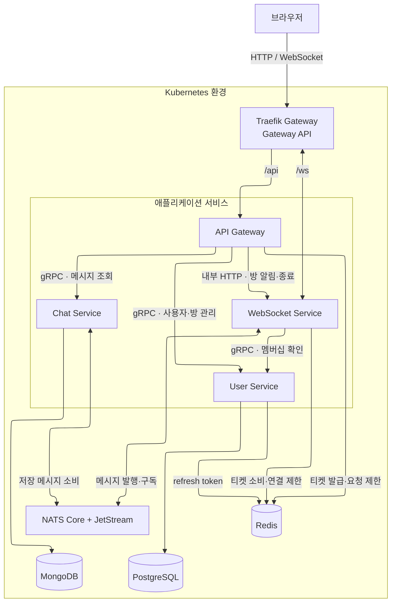
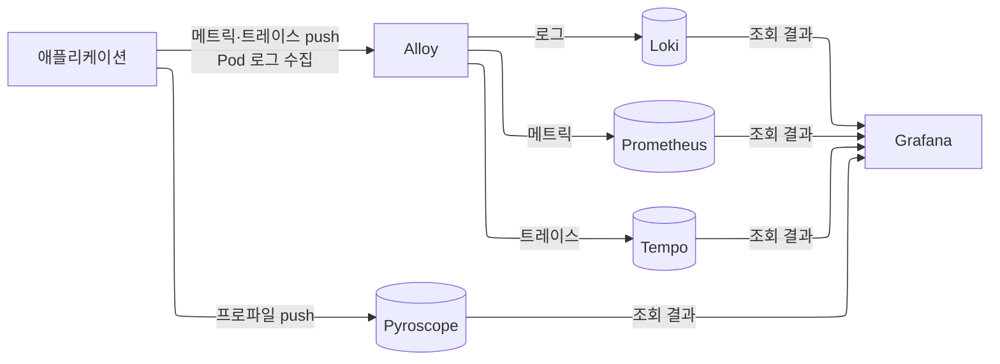

# Go Chat MSA

Go로 만든 MSA 채팅 서버이며, 저지연 메시징과 유연한 수평 확장을 목표로 합니다.

Kubernetes 위에서 무상태 웹소켓 서비스를 운영하며, JetStream에 기록한 메시지를 NATS로 전달하고 MongoDB에 비동기로 저장합니다.

관측성 확보를 위해 OpenTelemetry 기반 Grafana 스택을 도입했습니다.

- 4개의 마이크로서비스가 REST · gRPC · WebSocket · NATS로 통신
- Kubernetes Service의 로드밸런싱으로 WebSocket 연결을 여러 Pod에 분산
- NATS Pub/Sub을 통한 Pod 간 메시지 브로드캐스트
- 웹소켓 서비스의 무상태 구조로 HPA 기반의 유연한 확장·축소 지원
- NATS JetStream 기반 메시지 영속화
- OTel 기반 Grafana 스택으로 로그 · 메트릭 · 트레이스 · 프로파일 통합 관측

### 관측성 기반의 병목 개선

k6 부하 테스트로 10,000명 동시 접속, 2K Ingress, 200K Egress 환경에서 메시지 P99 레이턴시 19ms를 기록했습니다.
Docker Compose 기준에서 병목을 제거해 최대 워커 P99 25ms를 확보했고, 현재 Kubernetes·NATS 구성에서는 4개 워커 모두 `<50ms` 기준을 통과했습니다.

| 병목 | 증상 | 원인 | 개선 | 결과 |
| :--- | :--- | :--- | :--- | :--- |
| Bcrypt CPU 병목 | 10K 가입·로그인 구간에서 HTTP 실패율 99.55%, P99 10s+ 발생 | 요청마다 `bcrypt` 해싱 고루틴이 제한 없이 생성되어 CPU 경합 발생. <br> 타임아웃 후 즉시 재시도되며 로그인 요청이 400,000회 이상으로 폭증 | CPU 코어 수 기준 워커 풀로 동시 해싱 수 제한. <br> 큐 포화 시 `ErrQueueFull` 반환, <br> k6에는 Jitter 백오프 적용 | HTTP 실패율 99.55% → 81%, P99 10s+ → 5.32s |
| k6 측정 병목 | k6에서 측정한 메시지 레이턴시가 10초 초과 | 단일 프로세스의 메트릭 수집·집계에 초당 약 200K 메시지의 계측 부하 집중. <br> 고부하에서 공용 샘플 채널이 일시적으로 포화되면 수신 처리가 대기하며 테일 레이턴시가 커질 수 있음 | k6 워커를 4개로 분리해 수집·집계 경로를 분산하고, Probe 1%로 echo 지연을 측정하며, Probe·Reconnector만 수신 메시지를 파싱 | 클라이언트 병목 해소로 서버 측과 유사한 레이턴시 확보 |
| 메시지 저장 병목 | 드랍이나 에러 없이 서버 Egress P99 1초, <br> k6 msg_latency P99 2초 발생 | 메시지마다 개별 gRPC 저장 호출을 수행해 초당 약 2,000회 gRPC RTT와 MongoDB write 발생. <br> 단일 호스트에서 저장 경로가 WebSocket 송신 처리와 syscall 경합 | 고정 워커가 500건 단위로 `BatchCreateMessages` 호출. <br> 100ms 타이머로 플러시하고, 저장 실패는 재시도 큐에서 처리 | 서버 Egress P99 1초 → 5ms, <br> k6 msg_latency P99 2초 → 25ms |

위 표는 초기 병목을 해결한 과정입니다. 상세 분석은 [Docker Compose C10K 병목과 해결 기록](docs/DOCKER_C10K_TROUBLESHOOTING.md), 현재 구성의 측정값은 [NATS C10K 보고서](docs/K8S_NATS_C10K_REPORT.md)에 정리했습니다.

## 스크린샷

> [!NOTE]
> 프론트엔드는 데모 목적으로 작성되었으며, 백엔드 설계와 구현에 초점을 맞춘 프로젝트입니다.

| 로비 | 채팅방 |
| :---: | :---: |
|  |  |

| Grafana 대시보드 |
| :---: |
|  |

## 실행 방법

애플리케이션 실행을 위해 아래 요소를 설치해야 합니다.

| 필수 설치 | 용도 |
| :--- | :--- |
| Docker | 이미지 빌드와 kind 노드 실행 |
| kind | 로컬 Kubernetes 클러스터 생성 |
| kubectl | K8s 리소스 적용과 상태 확인 |
| Make | 실행 명령 단순화 |

설치 후 아래 명령어로 K8s 클러스터와 애플리케이션을 함께 실행할 수 있습니다.

```bash
make dev-up
```

| 서비스 | URL |
| :--- | :--- |
| 프론트엔드 | http://dev.gochat.localhost:30080/ |
| Swagger UI | http://dev.gochat.localhost:30080/docs/ |
| Grafana | http://dev.gochat.localhost:30080/grafana/ |

## 아키텍처


```mermaid
---
config:
  layout: elk
---
flowchart TB
    Client["브라우저"]

    subgraph K8s ["Kubernetes 환경"]
        Ingress["Traefik Gateway<br/>Gateway API"]

        subgraph Services ["애플리케이션 서비스"]
            AGW["API Gateway"]
            WSS["WebSocket Service"]
            US["User Service"]
            CS["Chat Service"]
        end

        NATS["NATS Core + JetStream"]
        RD[("Redis")]
        PG[("PostgreSQL")]
        MG[("MongoDB")]
    end

    Client -->|"HTTP / WebSocket"| Ingress
    Ingress -->|"/api"| AGW
    Ingress <-->|"/ws"| WSS
    AGW -->|"gRPC · 사용자·방 관리"| US
    AGW -->|"gRPC · 메시지 조회"| CS
    AGW -->|"내부 HTTP · 방 알림·종료"| WSS
    WSS -->|"gRPC · 멤버십 확인"| US
    WSS <-->|"메시지 발행·구독"| NATS
    CS <-->|"저장 메시지 소비"| NATS
    Services ~~~ NATS
    NATS ~~~ PG & MG
    US --> PG
    CS --> MG
    AGW -->|"티켓 발급·요청 제한"| RD
    WSS -->|"티켓 소비·연결 제한"| RD
    US -->|"refresh token"| RD
```

| 서비스 | 책임 | 통신 | 상태/저장소 |
| :--- | :--- | :--- | :--- |
| `api-gateway` | REST API 진입점, JWT 검증, WebSocket 티켓 발급 | HTTP, gRPC | Redis |
| `websocket-service` | 세션 관리, 메시지 발행·구독 및 브로드캐스트 | HTTP/WebSocket, gRPC, NATS | Redis |
| `user-service` | 사용자, 채팅방, refresh token 관리 | gRPC | PostgreSQL, Redis |
| `chat-service` | 메시지 비동기 배치 저장, 조회 | gRPC, NATS JetStream | MongoDB |

상세 흐름은 다이어그램으로 분리했습니다.

| 다이어그램 | 내용 |
| :--- | :--- |
| [Kubernetes 실행 아키텍처](docs/diagrams/flow-k8s-architecture.mmd) | Ingress, 서비스, 데이터 계층, 관측성 구성 |
| [방 구독 생명주기](docs/diagrams/seq-room-subscription.mmd) | NATS 방 구독과 로컬 세션 관리 |
| [재연결과 메시지 복구](docs/diagrams/seq-reconnect-recovery.mmd) | Pod 종료 후 재연결과 메시지 조회 |
| [메시지 처리 흐름](docs/diagrams/flow-message.mmd) | JetStream 기록, 브로드캐스트, 비동기 저장 |

## 주요 설계 결정

### 무상태 웹소켓 서비스와 수평 확장

WebSocket 연결은 여러 웹소켓 서비스 인스턴스에 분산됩니다.
각 인스턴스는 채팅방 ID 기반의 NATS Pub/Sub으로 메시지를 받아, 같은 방의 로컬 세션에 브로드캐스트합니다.

이 구조의 목적은 여러 인스턴스가 같은 방의 연결을 나눠 처리하며 유연하게 수평 확장하는 것입니다.
웹소켓 서비스는 연결과 로컬 Hub를 관리하고, JetStream은 저장 대기 메시지를 보관하며 채팅 서비스가 MongoDB에 저장합니다.

연결 시에는 API 게이트웨이가 발급한 일회성 티켓과 방 멤버십을 확인하고, NATS 구독을 준비한 뒤 WebSocket 연결을 수락합니다.
참여·나가기 알림과 방 종료는 API 게이트웨이가 내부 HTTP로 요청하며, 요청받은 인스턴스가 Core NATS로 전파해 각 인스턴스의 로컬 세션에 반영합니다.

인스턴스 증설 시에는 기존 연결을 유지하고 새 연결부터 분산합니다.
축소나 재시작으로 연결이 끊기면 클라이언트가 새 티켓을 발급받아 재연결하고, 연결이 끊긴 동안의 메시지는 MongoDB에 저장된 이력을 조회해 복구합니다.

NATS 연결 단절을 감지하면 readiness를 내리고 기존 세션을 종료합니다.
NATS slow consumer로 유실을 감지하면 NATS를 재연결하고 해당 Pod의 모든 세션을 종료합니다. 전달 지연 한도 초과는 해당 방의 로컬 세션을, 전송 큐 포화는 해당 세션을 종료해 재연결과 메시지 복구를 유도합니다.

### 웹소켓 서비스 계층 구조

웹소켓 서비스는 연결 수명, 방 구독, 세션 목록과 브로드캐스트를 다룹니다.
이 책임을 한 계층에 모으면 상태 변경 순서를 추적하기 어려워지므로 Router, Manager, Hub, Session으로 나눴습니다.
의존 방향은 위에서 아래로만 흐르게 제한했습니다.

```text
Router (Pod당 1개)
└── Manager (Pod당 1개)
    ├── Hub (채팅방 A)
    │   ├── Session (유저 1)
    │   └── Session (유저 2)
    └── Hub (채팅방 B)
        └── Session (유저 3)
```

Manager와 Hub는 액터 모델로 동시성을 처리합니다. Manager는 Hub 목록과 구독의 생명주기를 단일 `select` 루프에서 관리하고, Hub는 로컬 세션 목록과 브로드캐스트를 자기 루프에서 순서대로 처리합니다.
외부와는 채널 또는 주입된 함수로 통신해 공유 상태를 직접 잠그는 범위를 줄였습니다.

| 계층 | 책임 |
| :--- | :--- |
| Router | HTTP 요청을 검증하고 WebSocket upgrade 전까지의 준비 절차를 조율 |
| Manager | 로컬 Hub·NATS 구독의 생성과 종료, 메시지 발행·제어 이벤트 |
| Hub | 한 방의 로컬 세션과 브로드캐스트를 직렬 처리 |
| Session | 개별 WebSocket 연결의 읽기/쓰기, 메시지 검증과 처리율 제한 |

자식 계층이 부모를 직접 참조하면 순환 의존이 생깁니다.
부모의 작업 큐로 넘기는 일은 송신 전용 채널로, 호출한 자리에서 바로 결과가 필요한 일은 콜백 함수로 분리했습니다.

### JetStream 기반 비동기 배치 저장

MongoDB 저장 지연이 실시간 전송 경로에 직접 영향을 주지 않도록, 저장은 채팅 서비스의 배치 워커에서 비동기로 처리합니다.
여러 메시지를 모아 저장해 개별 쓰기 비용을 줄이고, 저장 대기 메시지는 JetStream에 보관합니다.

웹소켓 서비스는 사용자 채팅을 JetStream에 발행하고, 성공 `PubAck`를 수락 기준으로 사용합니다.
JetStream은 메시지를 기록한 뒤 Core NATS로 재발행하고, 각 웹소켓 서비스가 구독한 방의 세션에 브로드캐스트합니다.
실시간 전달은 MongoDB 저장 완료까지 기다리지 않지만, JetStream 기록에 걸리는 시간은 포함합니다.

채팅 서비스의 워커들은 하나의 durable pull consumer를 공유해 메시지를 나눠 처리합니다.
MongoDB에 배치 저장한 뒤 메시지별로 ACK하며, 워커 종료로 ACK되지 않은 메시지는 재전달됩니다.

재전달과 클라이언트 재시도에 대응하기 위해 메시지 저장은 멱등하게 처리합니다.
메시지 ID 또는 `(채팅방 ID, 발신자 ID, 클라이언트 메시지 ID)`가 같으면 기존 내용과 대조해 중복 저장을 막습니다.
일시적인 저장 오류는 재시도하고, 검증 오류나 내용 충돌은 DLQ에 기록한 뒤 원본을 ACK합니다.

이 구조에서는 실시간으로 받은 메시지가 MongoDB 조회 결과에는 아직 나타나지 않을 수 있습니다.
이를 보완하기 위해 서버는 UUIDv7 ID 기반 조회 API를 제공하고, 반복 조회와 메시지 병합은 클라이언트가 담당하도록 했습니다.

클라이언트는 조회 시작점을 마지막 수신 ID보다 앞선 시점으로 되감고, 고정한 시작점부터 일정 시간 반복 조회합니다.
시작점을 최신 메시지로 옮기지 않아야 그보다 작은 ID로 뒤늦게 저장된 메시지도 포함할 수 있기 때문입니다.
조회 결과는 실시간 메시지와 합쳐 UUIDv7 ID로 정렬하고, 서버 ID·클라이언트 메시지 키로 중복을 제거합니다. 재연결 외에도 화면 포커스 복귀와 주기적인 동기화로 늦게 저장된 메시지를 보충합니다.

### bcrypt 워커 풀

bcrypt는 무차별 대입을 어렵게 만들기 위해 의도적으로 느리게 동작하는 CPU 바운드 해시 알고리즘입니다.  
DB나 네트워크 I/O는 응답을 기다리는 동안 고루틴이 block되어 다른 고루틴이 CPU를 사용할 수 있지만, bcrypt는 실행되는 동안 CPU를 계속 사용합니다.  
Go 런타임이 동시에 실행할 수 있는 Go 코드는 `GOMAXPROCS` 범위로 제한되므로, CPU 바운드 작업은 많이 시작한다고 처리량이 그만큼 늘지 않고 오히려 스케줄링 비용만 증가합니다.

가입이나 로그인 요청이 몰릴 때 모든 요청 고루틴이 bcrypt를 바로 수행하면, 코어 수보다 많은 해싱 작업이 한정된 CPU 시간을 나눠 갖습니다.  
작업 하나가 빨리 끝나기보다 여러 작업이 동시에 조금씩 진행되면서 대기열이 길어집니다.  
이 상태가 길어지면 인증 요청뿐만 아니라 같은 인스턴스의 다른 요청도 함께 밀립니다.

이를 방지하기 위해 bcrypt 연산에는 워커 풀 패턴을 도입했습니다.  
워커 수는 `runtime.GOMAXPROCS(0)` 기준으로 두어 동시에 실행되는 해싱 수를 실제 병렬 실행 폭에 맞춥니다.  
짧은 순간의 요청 증가는 제한된 큐로 흡수하되, 큐가 가득 차면 더 기다리게 하지 않고 `ErrQueueFull`을 반환합니다.  

이는 일부 요청을 빠르게 실패시키는 대신, CPU 경합이 user-service 인스턴스 전체로 번지는 것을 막기 위한 것입니다.  
user-service는 `ErrQueueFull`을 `ResourceExhausted`로 바꿔 gateway가 과부하 응답을 낼 수 있게 합니다.  
과부하를 서버 내부에 숨기지 않고 빠르게 클라이언트에게 알리며, 관측 가능한 지표로 남기는 것이 목적입니다.

## 관측성

관측성을 확보하여 장애 원인을 빠르게 찾고, 병목 지점을 확인하여 시스템을 지속적으로 개선했습니다.  
메트릭으로 이상 범위를 잡고, 트레이스와 로그로 요청 맥락을 확인합니다.  
프로파일은 코드 레벨 병목을 볼 때 사용합니다.

계측은 OTel SDK와 Grafana 스택으로 통일했습니다.  
Alloy는 로그, 메트릭, 트레이스를 수집합니다.  
프로파일은 앱 SDK가 Pyroscope로 직접 전송합니다.


```mermaid
---
config:
  layout: elk
---
flowchart LR
    Apps["애플리케이션"]
    Alloy["Alloy"]
    Loki[("Loki")]
    Prometheus[("Prometheus")]
    Tempo[("Tempo")]
    Pyroscope[("Pyroscope")]
    Grafana["Grafana"]

    Apps -->|"메트릭·트레이스 push<br/>Pod 로그 수집"| Alloy
    Apps -->|"프로파일 push"| Pyroscope
    Alloy -->|"로그"| Loki
    Alloy -->|"메트릭"| Prometheus
    Alloy -->|"트레이스"| Tempo
    Loki & Prometheus & Tempo & Pyroscope -->|"조회 결과"| Grafana
```

| 신호 | 백엔드 | 용도 |
| :--- | :--- | :--- |
| 로그 | Loki | 이벤트 기록 검색, `trace_id` 기준 요청 추적 |
| 메트릭 | Prometheus | API 레이턴시, 오류율, WebSocket·NATS 지표 확인 |
| 트레이스 | Tempo | HTTP/gRPC/Redis/DB 호출 흐름 추적 |
| 프로파일 | Pyroscope | CPU·힙 메모리·goroutine과 코드 병목 분석 |

Grafana 대시보드는 전체 상태에서 시작해 API, 실시간 메시지, 저장소, 런타임을 목적에 맞게 확인할 수 있도록 구성했습니다.

NATS 경계에서 트레이스가 이어지지 않는 메시지 전달·저장 경로는 전용 메트릭과 프로파일로 확인합니다. 전달 지연과 함께 발행 실패·큐 포화·저장 적체·DLQ를 살펴봅니다.

상세 계측 항목은 [텔레메트리 카탈로그](docs/TELEMETRY_CATALOG.md)에 정리했습니다.

## Kubernetes 실행 기준

Kubernetes 매니페스트는 `base`와 환경별 오버레이로 나눕니다. `bootstrap.sh`가 PostgreSQL·MongoDB·Redis·NATS, 관측성, 마이그레이션, 애플리케이션을 순서대로 준비합니다.

| 환경 | 주요 설정 | 용도 |
| :--- | :--- | :--- |
| `dev` | 웹소켓 서비스 Pod 2개 | 개발·C10K 부하 테스트 |
| `test` | Go 서비스별 Pod 2개, Toxiproxy | 다중 Pod E2E·MongoDB 연결 장애 복구 |
| `qa` | 웹소켓 서비스 Pod 1~2개 자동 확장(HPA), Pod당 목표 연결 100개 | 확장·재연결 검증, 별도 강제 축소 실험 |

API 게이트웨이와 웹소켓 서비스는 ClusterIP, 사용자 서비스와 채팅 서비스는 Headless Service를 사용합니다. 채팅 서비스는 메시지 수락과 MongoDB 조회의 준비 상태를 분리해, DB 장애가 웹소켓 송수신 경로의 준비 상태를 해제하지 않게 합니다.

### 코드·설정 검증

```bash
go test ./...
go test -tags=integration ./...
go tool task check
```

E2E는 `test` 환경을 준비한 뒤 실행합니다.

```bash
make test-up
go test -tags=e2e ./test/e2e
```

### 부하·HPA 검증

필요한 환경을 선택해 실행합니다. 각 명령의 측정 범위와 조건은 아래 검증 보고서를 기준으로 합니다.

```bash
make dev-up
make dev-load
```

```bash
make qa-up
make qa-load
```

두 부하 시나리오는 클러스터 내부 Service에 직접 요청하며 Traefik 구간은 측정하지 않습니다. `qa-load`는 웹소켓 서비스 Pod를 1개로 되돌린 뒤 HPA 확장과 재연결·복구를 검증합니다.

### 정리

```bash
make dev-down
make test-down
make qa-down
make kind-delete
```

`*-down`은 해당 namespace와 관련 RBAC을 삭제합니다. `kind-delete`는 클러스터 전체와 그 데이터를 삭제합니다.
현재 로컬 환경의 저장소는 `emptyDir`을 사용하므로 Pod 교체 시 데이터가 사라집니다.

## 검증 결과

아래는 2026-09-24에 실행한 Kubernetes·NATS 구성의 C10K 결과입니다.

### C10K 부하 테스트

로컬 kind Kubernetes v1.37.0의 `dev` 환경에서 k6 v2.3.0 워커 4개, 목표 10,000 VU, 100개 방으로 측정했습니다. 웹소켓 서비스·채팅 서비스·NATS의 Pod 수는 각각 2·1·1개입니다.

| 항목 | 결과 |
| :--- | :--- |
| 활성 웹소켓 연결 관측 최대 | 9,993개 |
| 송신 시도 / echo 지연 표본 | 1,187,289 / 6,971건 |
| 워커별 메시지 P99 | 19 / 16 / 12 / 12ms |
| 서버 Fanout / Egress 최대 P99 | 1.53 / 8.86ms |
| 송신 오류 / 메시지 타임아웃 | 0 / 0 |
| OOM / Pod 재시작 | 0 / 0 |
| 종료 후 저장 대기 메시지 / DLQ 메시지 | 0 / 0 |
| `<50ms` 기준 | 4개 워커 모두 PASS |

지연은 표본 측정용 가상 사용자(VU)의 송신부터 자신의 메시지를 돌려받는 echo까지 측정한 값입니다. 워커별 P99를 전체 요청의 통합 P99로 해석하거나, 오류·저장 대기 메시지 0만으로 전체 메시지 무손실을 판단하지 않습니다. 서버 값은 Pod별 전체 실행 P99 중 최댓값입니다.

환경과 서비스별 자원 사용량은 [NATS C10K 보고서](docs/K8S_NATS_C10K_REPORT.md)에 있습니다.

### 웹소켓 서비스 HPA·장애 복구

로컬 kind `qa` 환경에서 HPA 1→2 확장과 별도 강제 2→1 축소를 검증했습니다. 확장·축소 중 메시지 송수신과 재연결 후 이력 동기화가 정상 동작했고, 최종 누락·중복 없이 메시지 정합성을 확인했습니다. 모든 k6 통과 기준을 충족했습니다.

`test` E2E는 MongoDB 연결 장애와 저장 워커 재시작·Pod 수 변경을 다룹니다. echo로 확인한 메시지 집합과 최종 DB 결과를 대조하고, 중복·저장 대기량·DLQ를 함께 확인합니다.

검증 범위와 장애 주입 방식은 [설계 문서](docs/DESIGN.md#62-장애-복구와-정합성-검증)에 정리했습니다.

## 더 살펴보기

| 문서 | 내용 |
| :--- | :--- |
| [DESIGN.md](docs/DESIGN.md) | 전체 설계와 트레이드오프 |
| [K8S_NATS_C10K_REPORT.md](docs/K8S_NATS_C10K_REPORT.md) | NATS 구성의 C10K 결과 |
| [RFC-0002](docs/rfcs/0002-jetstream-durable-message-persistence.md) | JetStream 채택 결정·검증 결과·후속 과제 |
| [K8S_C10K_REPORT.md](docs/K8S_C10K_REPORT.md) | JetStream 도입 전 Kubernetes C10K 기록 |
| [TELEMETRY_CATALOG.md](docs/TELEMETRY_CATALOG.md) | 로그/메트릭/트레이스/프로파일 카탈로그 |
| [DOCKER_C10K_REPORT.md](docs/DOCKER_C10K_REPORT.md) | Docker Compose C10K 성능 기준 |
| [DOCKER_C10K_TROUBLESHOOTING.md](docs/DOCKER_C10K_TROUBLESHOOTING.md) | Docker Compose C10K 병목과 해결 기록 |

| 다이어그램 | 내용 |
| :--- | :--- |
| [Kubernetes 실행 아키텍처](docs/diagrams/flow-k8s-architecture.mmd) | Ingress, 서비스, 데이터 계층, 관측성 구성 |
| [로그인과 웹소켓 인증](docs/diagrams/seq-auth-ticket.mmd) | 로그인, 갱신 토큰, 웹소켓 연결 티켓 발급 |
| [웹소켓 연결](docs/diagrams/seq-websocket.mmd) | 티켓·멤버십 검증, 방 구독 준비, 세션 등록 |
| [방 구독 생명주기](docs/diagrams/seq-room-subscription.mmd) | 여러 Pod의 방 구독과 로컬 세션 정리 |
| [재연결과 메시지 복구](docs/diagrams/seq-reconnect-recovery.mmd) | Pod 종료 후 새 연결과 MongoDB 복구 조회 |
| [메시지 처리 흐름](docs/diagrams/flow-message.mmd) | JetStream 수락, Core RePublish, MongoDB 저장·복구 |

Docker Compose는 더 이상 기본 실행 경로가 아닙니다.  
K8s 전환 전 C10K 기준점은 `legacy-compose-baseline` 태그와 Docker Compose 문서로 남겼습니다.
