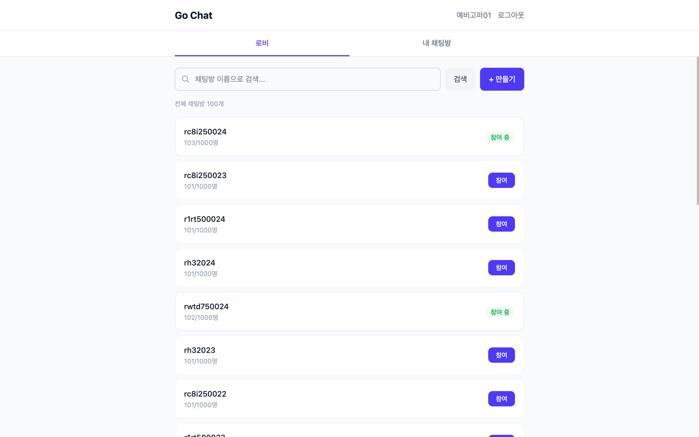
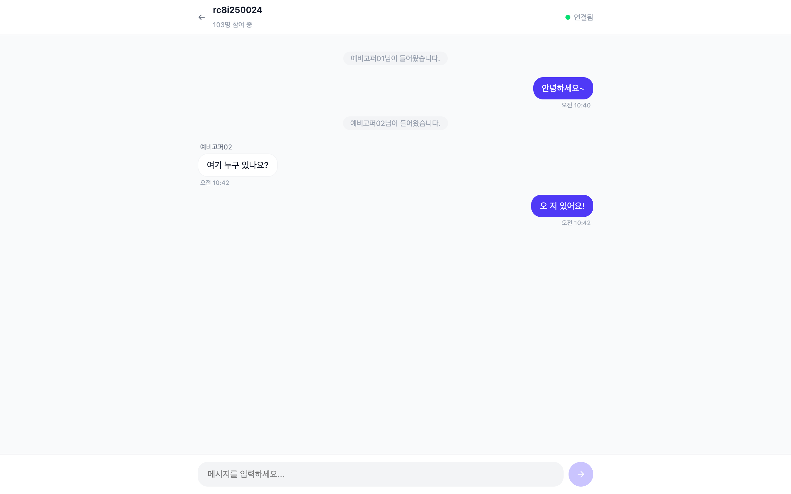
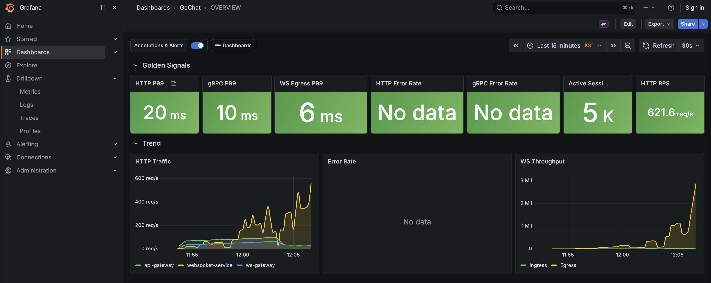
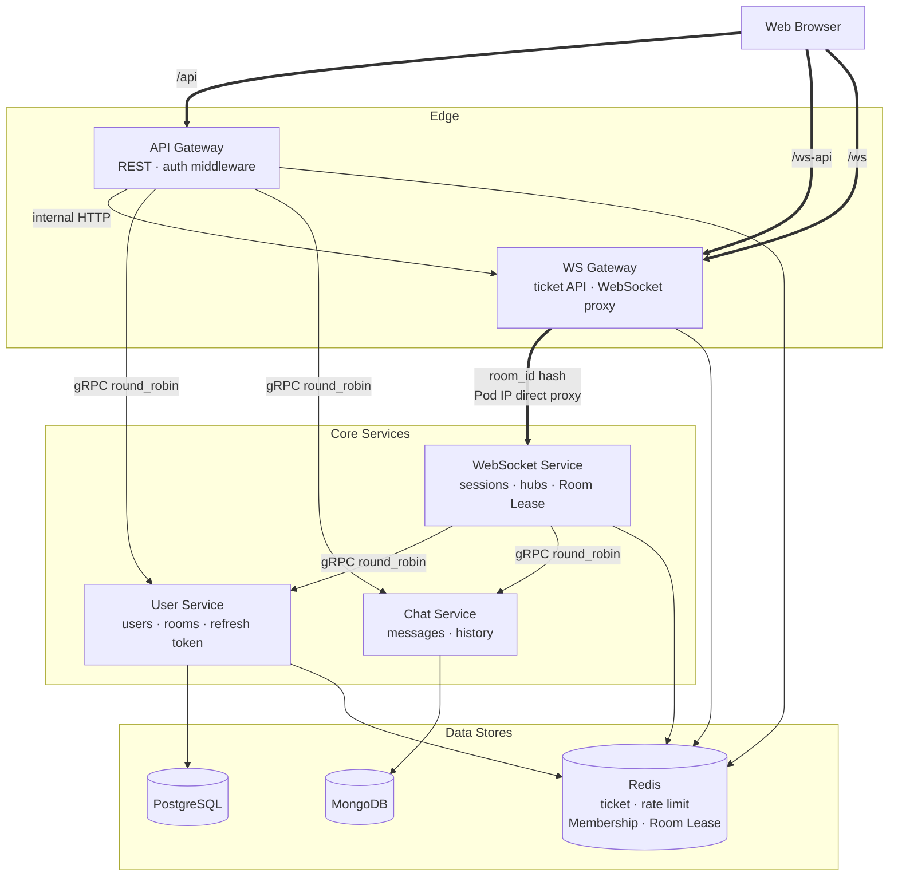

# Go Chat MSA

Go와 Kubernetes로 구현한 실시간 채팅 MSA 프로젝트입니다.

REST, gRPC, WebSocket 서비스를 분리하고, WebSocket Room Owner Routing, gRPC client-side load balancing, Redis 기반 분산 상태, Kubernetes fixed replicas/HPA 환경에서의 메시지 정합성을 검증했습니다.

## Highlights

- 5개 Go 백엔드 서비스와 1개 frontend로 구성한 채팅 MSA
- Redis Membership + Consistent Hashing으로 채팅방별 WebSocket Owner Pod 선택
- Room Lease + graceful drain으로 HPA/rollout handoff 중 Sequence 중복과 저장 race 방지
- Headless Service + gRPC `round_robin`으로 user/chat backend 멀티 Pod 분산
- K8s `dev`/`test`/`qa` overlays로 개발, E2E, HPA 정합성 검증 분리
- Grafana, Prometheus, Loki, Tempo, Pyroscope 기반 로그/메트릭/트레이스/프로파일 통합 관측
- Docker C10K baseline과 WebSocket HPA handoff 정합성 검증 결과 보유

| 분류 | 기술 |
|------|------|
| Language | Go 1.26 |
| Protocol | HTTP, WebSocket, gRPC |
| Storage | PostgreSQL 17, MongoDB 7.0, Redis 7 |
| Auth | JWT access token, HttpOnly refresh token, Redis TTL refresh rotation |
| Routing | Consistent Hashing, Redis Membership, Room Lease |
| Observability | OpenTelemetry, Grafana, Prometheus, Loki, Tempo, Pyroscope |
| Infra | Kubernetes, Kustomize, kind, ingress-nginx, Prometheus Adapter |
| Test | Go test, Testcontainers, K8s E2E, k6 |

## Screenshots

> 프론트엔드는 데모 목적이며, 핵심은 백엔드 분산 설계와 Kubernetes 검증입니다.

| 로비 | 채팅 |
|:---:|:---:|
|  |  |

| 대시보드 |
|:---:|
|  |

## Architecture


```mermaid
flowchart TB
    Browser["Web Browser"]

    subgraph Edge["Edge"]
        AGW["API Gateway<br/>REST · auth middleware"]
        WSGW["WS Gateway<br/>ticket API · WebSocket proxy"]
    end

    subgraph Core["Core Services"]
        UserSvc["User Service<br/>users · rooms · refresh token"]
        ChatSvc["Chat Service<br/>messages · history"]
        WSSvc["WebSocket Service<br/>sessions · hubs · Room Lease"]
    end

    subgraph Data["Data Stores"]
        PG[("PostgreSQL")]
        MG[("MongoDB")]
        RD[("Redis<br/>ticket · rate limit<br/>Membership · Room Lease")]
    end

    Browser == "/api" ==> AGW
    Browser == "/ws-api" ==> WSGW
    Browser == "/ws" ==> WSGW

    AGW -- "internal HTTP" --> WSGW
    WSGW == "room_id hash<br/>Pod IP direct proxy" ==> WSSvc

    AGW -- "gRPC round_robin" --> UserSvc
    AGW -- "gRPC round_robin" --> ChatSvc
    WSSvc -- "gRPC round_robin" --> UserSvc
    WSSvc -- "gRPC round_robin" --> ChatSvc

    UserSvc --> PG
    UserSvc --> RD
    ChatSvc --> MG
    AGW --> RD
    WSGW --> RD
    WSSvc --> RD
```

| 서비스 | 역할 | 프로토콜 | 저장소 |
|------|------|----------|--------|
| `api-gateway` | REST API 진입점, 인증 미들웨어, API version routing | HTTP | Redis |
| `ws-gateway` | WebSocket ticket API, L7 reverse proxy, owner routing | HTTP/WebSocket proxy | Redis |
| `websocket-service` | 세션/Hub 관리, fan-out, Sequence, Room Lease Handoff | WebSocket, gRPC client | Redis |
| `user-service` | 사용자, 채팅방, 멤버십, refresh token 상태 | gRPC | PostgreSQL, Redis |
| `chat-service` | 메시지 저장, 히스토리/catch-up 조회 | gRPC | MongoDB |
| `frontend` | 데모 UI | HTTP | - |

상세 다이어그램은 [docs/diagrams](docs/diagrams)에서 확인할 수 있습니다.

## Kubernetes Environments

로컬 Kubernetes는 kind 기준입니다. Docker Compose는 active 실행 경로에서 제거했고, Docker는 이미지 빌드와 kind image load에만 사용합니다.

| 환경 | 명령 | 목적 | 주요 설정 |
|------|------|------|----------|
| `dev` | `make dev-up` | 브라우저/API 확인, C10K 부하 경로 | `websocket-service` 2 replicas, `dev-load` |
| `test` | `make test-up` | K8s E2E correctness | gateway/service 2 replicas 고정 |
| `qa` | `make qa-up` | WebSocket HPA handoff 정합성 | `websocket-service` HPA 1→2, Prometheus Adapter |

로컬 kind 클러스터는 control-plane 1개와 worker 1개로 구성합니다.
Ingress controller는 control-plane의 host port `30080`으로 노출되고, 애플리케이션 Pod는 worker에 스케줄됩니다.

### Prerequisites

| Tool | Purpose |
|------|---------|
| Docker | 이미지 빌드, kind node runtime |
| kind | 로컬 Kubernetes 클러스터 |
| kubectl | K8s 리소스 적용/조회 |
| Go | 테스트 실행 |
| Make | 표준 명령 실행 |

권장 로컬 사양은 CPU 4코어, 메모리 16GB 이상입니다.
`dev`, `test`, `qa`를 동시에 띄우거나 k6 부하를 반복 실행하면 더 많은 메모리가 필요합니다.

### Run

```bash
make dev-up
```

`make dev-up`은 kind 클러스터 생성, ingress-nginx 설치, 커널 튜닝, 이미지 빌드/load, K8s bootstrap을 순서대로 수행합니다.

| 서비스 | URL |
|------|-----|
| Frontend | http://dev.gochat.localhost:30080/ |
| API health | http://dev.gochat.localhost:30080/api/health |
| WS health | http://dev.gochat.localhost:30080/ws-api/health |
| OpenAPI | http://dev.gochat.localhost:30080/docs/ |
| Grafana | http://dev.gochat.localhost:30080/grafana/ |

다른 환경은 host만 바뀝니다.

| 환경 | Host |
|------|------|
| `dev` | `dev.gochat.localhost:30080` |
| `test` | `test.gochat.localhost:30080` |
| `qa` | `qa.gochat.localhost:30080` |

### Validate Manifests

```bash
make k8s-validate
```

모든 base/phase/overlay를 `kubectl kustomize`로 렌더링합니다.

### E2E

```bash
make test-up
go test -count=1 -tags=e2e ./test/e2e
```

`test` overlay는 주요 gateway/service를 2 replicas로 고정합니다.
E2E는 인증, 방 생성/입장, 메시지 송수신, reconnect/catch-up, Redis membership, multi-instance correctness를 블랙박스로 검증합니다.

### Load Tests

```bash
make dev-load
```

`dev-load`는 K8s 내부에서 k6 Pod 4개를 띄워 `test/load/c10k-test.js`를 실행합니다.
목적은 Docker Compose 시절 C10K baseline과 같은 부하 경로를 K8s에서 재검증하는 것입니다.

```bash
make qa-load
```

`qa-load`는 `websocket-service`를 1 replica로 reset하고 HPA를 다시 적용한 뒤 `test/load/hpa-test.js`를 실행합니다.
목적은 HPA scale-out 중 Room Owner Handoff가 메시지 Sequence 정합성을 깨지 않는지 검증하는 것입니다.

### Cleanup

```bash
make dev-down
make test-down
make qa-down
make kind-delete
```

## Verified Results

### C10K Legacy Baseline

Docker Compose 기준으로 아래 부하를 통과한 기록을 보존합니다.

| 항목 | 값 |
|------|-----|
| 동시 접속 | 10,000 |
| 채팅방 | 100개 |
| 방당 인원 | 100명 |
| Ingress | 2K messages/sec |
| Egress | 200K messages/sec |
| 메시지 P99 | 19~25ms |
| history/sync 조회 P99 | 10~19ms |
| 메시지 타임아웃 | 0 |

상세 기록은 [DOCKER_C10K_REPORT.md](docs/DOCKER_C10K_REPORT.md)와 [DOCKER_C10K_TROUBLESHOOTING.md](docs/DOCKER_C10K_TROUBLESHOOTING.md)에 정리했습니다.

### WebSocket HPA Consistency

로컬 kind `qa`에서 `websocket-service` HPA `1→2` scale-out 중 정합성 시나리오를 통과했습니다.

| 항목 | 결과 |
|------|------|
| k6 Job | `k6-hpa Complete 1/1` |
| HTTP failure | 0 |
| WebSocket error | 0 |
| sequence duplicate | 0 |
| sequence regression | 0 |
| sync gap observed/recovered | 2 / 2 |
| sync gap discarded | 0 |
| Mongo sequence hole | 0 |
| message latency P99 | 4ms |
| sync fetch P99 | 15.33ms |

이 수치는 운영 성능 지표가 아니라 HPA handoff 정합성 검증 결과입니다.
K8s `dev-load` C10K 결과는 [K8S_C10K_REPORT.md](docs/K8S_C10K_REPORT.md)에 정리했습니다.

## Design Notes

1. **WebSocket Room Owner Routing**
   같은 채팅방의 세션을 같은 WebSocket Service Pod에 모아 fan-out을 인메모리로 처리합니다. Redis Pub/Sub을 hot path에 넣지 않고, Redis는 membership과 lease 같은 control plane에만 사용합니다.

2. **Room Lease Handoff**
   HPA나 rollout으로 Room Owner가 바뀔 때 이전 Owner가 이미 fan-out한 메시지의 Persist ACK를 기다린 뒤 Lease를 release합니다. Persist 실패가 확정되면 Redis Sequence Floor에 마지막 발급 Sequence를 남기고, 새 Owner는 `max(MongoDB last sequence, Redis Sequence Floor)` 기준으로 이어서 발급합니다.

3. **gRPC Headless Service**
   user/chat backend는 Headless Service와 gRPC `round_robin`으로 Pod별 HTTP/2 subchannel을 만듭니다. 단, gRPC resolver는 EndpointSlice watch가 아니므로 gRPC backend HPA는 별도 측정 대상입니다.

4. **Refresh token Redis state**
   TTL성 인증 상태를 PostgreSQL에서 Redis로 옮기고, rotation/reuse detection/revoke-all을 Lua script로 원자 처리합니다. 이로써 token purge loop/CronJob이 필요 없어졌습니다.

5. **K8s 실행 경로 단일화**
   Docker Compose는 legacy baseline으로만 남기고, 개발 확인, E2E, HPA 검증은 K8s overlay로 통일했습니다.

## Documentation

| 문서 | 내용 |
|------|------|
| [DESIGN.md](docs/DESIGN.md) | 전체 설계와 트레이드오프 |
| [TELEMETRY_CATALOG.md](docs/TELEMETRY_CATALOG.md) | 로그/메트릭/트레이스/프로파일 카탈로그 |
| [DOCKER_C10K_REPORT.md](docs/DOCKER_C10K_REPORT.md) | Docker Compose C10K 성능 baseline |
| [DOCKER_C10K_TROUBLESHOOTING.md](docs/DOCKER_C10K_TROUBLESHOOTING.md) | Docker Compose C10K 병목과 해결 기록 |
| [K8S_C10K_REPORT.md](docs/K8S_C10K_REPORT.md) | K8s `dev-load` C10K 성능 baseline |

## Production Boundary

이 프로젝트의 K8s 매니페스트는 로컬 검증용입니다.
PostgreSQL, MongoDB, Redis, observability stack은 kind 안에 함께 띄우지만, 운영으로 승격하려면 managed DB, backup/restore, Redis HA, Secret 관리, RBAC, NetworkPolicy, image tag 정책, multi-node rollout/drain runbook을 별도로 설계해야 합니다.
