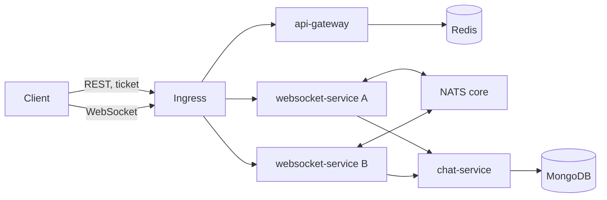

<!-- RFC 상태: Draft | Experimenting | Accepted | Rejected -->
<!-- RFC 목차: 0. 요약 → 1. 배경과 목표 → 2. 제안 → 3. 계약 변경 → 4. 구현 범위 → 5. 대안과 트레이드오프 → 6. 검증 → 7. 결론과 후속 작업 -->

# RFC-0001: NATS 기반 무상태 WebSocket 브로드캐스트

| 항목 | 내용 |
| :--- | :--- |
| 상태 | Accepted |
| 작성자 | happyhun |
| 결정일 | 2026-09-15 |
| 작업 브랜치 | `integration/nats-broadcast` |
| 대상 | websocket-service, ws-gateway(제거), api-gateway, chat-service, frontend, NATS, Redis, MongoDB, Kubernetes, 관측성, 부하 테스트 |
| 기준 문서 | [DESIGN.md](../DESIGN.md), [Kubernetes C10K 부하 테스트 보고서](../K8S_C10K_REPORT.md) |

## 0. 요약

방별 consistent hashing과 소유권 이전을 제거하고 모든 websocket-service Pod가 NATS core를 통해 메시지를 교환한다. WebSocket 연결은 Kubernetes Service가 분산하고, 각 Pod는 자신에게 연결된 세션만 관리한다. ws-gateway는 제거하고 티켓 발급은 api-gateway, 티켓 소비와 WebSocket 처리는 websocket-service가 맡는다.

연속 순번 대신 UUIDv7을 메시지 id와 정렬 기준으로 사용한다. 여러 발행자 사이에서 도착 순서가 바뀌면 프론트엔드가 id 순서로 다시 정렬한다. WebSocket 송신 큐의 누락은 `frame_no`로 감지하지만, history→subscribe 경계에서 커서 이전으로 밀린 메시지는 감지할 수 없다. 연결 직후 기존 커서로 싱크하고, 비동기 저장을 기다리기 위해 2초 후 연결 직전 커서를 2초 되감아 다시 조회한다. 재조회로 겹치는 메시지는 `id`와 `client_msg_id`로 제거한다. 영속화되지 않은 메시지의 유실은 JetStream 도입 전까지 복구할 수 없다.

되감기 복구 트래픽을 제외한 C10K 실행에서 `msg_latency` P99는 22.84~31ms로 기준선 41~43ms보다 낮았고 오류와 메시지 타임아웃은 없었다. 되감기를 포함한 정합성은 별도 HPA 시나리오로 검증했다.

## 1. 배경과 목표

현재 main은 같은 방의 연결을 하나의 websocket-service Pod로 모으기 위해 다음 분산 상태를 유지한다.

| 상태 | 역할 |
| :--- | :--- |
| 멤버십과 해시 링 | 방 담당 Pod 선택 |
| 방 lease | 동시에 두 Pod가 방을 소유하지 않도록 보호 |
| 방 순번 기준값 | 소유권 변경과 저장 실패 뒤 순번 충돌 방지 |
| 소유권 이전 절차 | 스케일아웃 시 Hub 이동과 클라이언트 재연결 |

이 구조는 메시지 경로가 짧지만 스케일링과 장애 복구가 복잡하고, ws-gateway가 모든 WebSocket 프레임을 중계한다.

이번 RFC의 목표는 다음과 같다.

- websocket-service에서 방 소유권과 인스턴스 멤버십을 제거한다.
- 어떤 Pod에 연결되어도 같은 방의 메시지를 주고받게 한다.
- ws-gateway를 제거해 연결 경로와 운영 요소를 줄인다.
- 기존 C10K 시나리오에서 클라이언트 `msg_latency` P99 50ms 미만을 유지한다.
- HPA 1→2 확장 중 연결 오류, 전달 누락과 중복을 측정한다.

이번 실험은 영속성 레이어의 보장 수준이나 지연을 개선하는 작업이 아니다. 저장은 기존처럼 WebSocket 응답 경로 밖의 메모리 큐에서 비동기로 처리한다.

## 2. 제안

### 2.1 아키텍처

- Kubernetes Service가 연결 단위로 websocket-service Pod를 선택한다.
- Pod는 활성 세션이 있는 방만 `room.msg.{roomID}`를 구독한다.
- 클라이언트 메시지와 시스템 메시지는 같은 NATS 경로로 발행한다.
- 모든 구독 Pod가 메시지를 받아 로컬 세션에 fan-out한다.
- 발행 성공 뒤 메시지를 로컬 영속성 큐에 넣고 chat-service가 MongoDB에 배치 저장한다.
- 방 삭제는 `room.event.{roomID}` 이벤트로 모든 Pod에 전파한다.

메시지마다 공유 저장소에서 연속 순번을 발급하면 무상태화는 가능하지만 중앙 왕복이 다시 생긴다. 이 제안은 연속 순번을 버리고 UUIDv7과 NATS 전달 순서를 택한다.

### 2.2 연결과 인증

1. 클라이언트가 Bearer token으로 `POST /auth/ws-ticket`을 호출한다.
2. api-gateway가 Redis에 30초 단일 사용 티켓을 저장한다.
3. 클라이언트가 `/ws?ticket={ticket}&room_id={roomID}`로 연결한다.
4. websocket-service가 티켓을 원자적으로 소비하고 방 멤버십을 확인한다.
5. Pod가 방 subject 구독과 `FlushTimeout`을 완료한 뒤 WebSocket을 업그레이드한다.
6. 연결이 열린 클라이언트는 마지막 id로 즉시 싱크하고, 2초 뒤 해당 id를 2초 되감아 한 번 더 확인한다.

직접 노출된 websocket-service는 Origin allowlist, IP 기반 연결 제한, 단일 사용 티켓을 적용한다. 내부 HTTP API는 공유 시크릿으로 보호한다. NATS는 격리된 kind 실험 환경 안에서 무인증·평문 단일 Pod로 실행한다.

### 2.3 발행과 저장

1. 세션이 입력 JSON, 메시지 길이, `type=chat`, 사용자·방 제한을 검증한다.
2. 저장 큐 슬롯을 먼저 예약한다. 큐가 가득 차면 발행하지 않고 일시 오류를 알린다.
3. UUIDv7 id와 수신 시각을 생성해 NATS에 발행한다.
4. 발행 메시지는 모든 구독 Pod를 거쳐 로컬 세션에 전달된다.
5. 발행 Pod가 메시지를 영속성 큐에 넣는다.
6. worker가 최대 500개 또는 100ms 단위로 chat-service에 저장한다.

NATS 재연결 버퍼는 비활성화한다. 연결이 끊긴 동안 발행을 성공으로 오인하지 않으며, readiness를 내리고 기존 세션을 닫아 클라이언트 재연결과 싱크를 유도한다. 영속성 재시도는 메모리 큐이므로 Pod 프로세스가 죽으면 유실될 수 있다.

### 2.4 정렬과 재동기화

UUIDv7 문자열의 사전순을 화면과 조회 결과의 정렬 기준으로 사용한다. 여러 Pod가 동시에 발행하면 생성 시각과 NATS 도착 순서가 어긋날 수 있으므로 프론트엔드는 실시간 메시지도 정렬 위치에 삽입한다.

각 세션은 송신 프레임에 1부터 증가하는 `frame_no`를 붙인다. 로컬 송신 큐에서 프레임이 버려지면 다음 번호가 건너뛰므로 클라이언트가 싱크를 시작한다. NATS에서 메시지를 받지 못한 Pod는 프레임 번호를 만들지 않으므로 개별 NATS 유실은 이 방식으로 감지할 수 없다. NATS 장애나 delivery lag는 서버가 연결을 닫아 재연결 싱크를 유도한다.

싱크는 `after_id`보다 큰 메시지를 id 오름차순으로 조회한다. 첫 싱크 이후 늦게 저장된 메시지의 id가 이미 관측한 최대 id보다 작으면 다음 조회에서 제외되지만 이를 직접 감지할 수는 없다. 따라서 지연 재조회는 항상 최초 커서를 2초 되감는다. 되감기 UUID는 원래 UUIDv7 타임스탬프에서 2초를 빼고 나머지 비트를 최소값으로 채운다. 후속 페이지는 응답의 마지막 id를 그대로 사용한다.

클라이언트는 다음 규칙을 적용한다.

- 초기 이력 조회 뒤 WebSocket을 연결하고 마지막 id로 즉시 싱크한 다음 2초 뒤 해당 id를 되감아 다시 싱크한다.
- 프레임 번호가 건너뛰거나 재연결돼도 같은 두 번의 싱크를 수행한다.
- 한 번의 싱크는 최대 5페이지까지 따라잡는다.
- `id` 또는 `client_msg_id`가 같으면 하나만 유지한다.
- 합친 메시지는 UUIDv7 id로 정렬한다.

2초는 이번 실행에서 관측된 역전 폭 최대 100ms와 정상 배치 저장 주기 100ms를 충분히 덮는 실험값이다. 첫 싱크 시점에 아직 저장되지 않은 history→subscribe 경계도 두 번째 싱크가 최초 기준 id를 되감아 회수한다. 이는 확률적 완화이며 at-most-once 전달이나 저장 재시도 최악 시간을 보장하지 않는다. 정확한 재생과 커서는 JetStream 스트림 순번을 도입할 때 해결한다.

### 2.5 종료와 장애 처리

| 상황 | 동작 |
| :--- | :--- |
| NATS disconnected | readiness 실패, 짧은 jitter 뒤 세션 1012 종료 |
| 구독 slow consumer | 해당 방 세션 1013 종료 |
| 메시지 delivery lag > 2초 | 해당 방 세션 1013 종료 |
| 영속성 큐 포화 | 신규 메시지 발행 거부, readiness 실패 |
| 방 삭제 | NATS 이벤트 발행 후 모든 Pod의 해당 방 세션 종료 |
| 프로세스 종료 | HTTP 요청 drain → Hub와 세션 종료 → 영속성 큐 drain → NATS drain |

기존 연결은 HPA 확장 때 새 Pod로 이동하지 않는다. 새 연결만 Service를 통해 분산되며, scale-down은 WebSocket 연결 수와 종료 유예를 고려해야 한다.

## 3. 계약 변경

### 3.1 외부 API와 WebSocket

| 계약 | 변경 |
| :--- | :--- |
| `POST /auth/ws-ticket` | api-gateway가 30초 단일 사용 티켓 발급 |
| `GET /ws` | websocket-service가 직접 티켓 소비와 업그레이드 처리 |
| `GET /rooms/{id}/messages` | `last_seq` 대신 UUID `after_id`, 응답에 `has_more` 추가 |
| 클라이언트 메시지 | `content`, `client_msg_id`, 선택적 `type=chat` |
| 서버 메시지 | `sequence_number` 제거, 연결별 `frame_no` 추가 |

메시지 조회 기본 한도는 이력 100개, 싱크 50개이며 최대 1,000개다. 이력은 id 내림차순, `after_id` 싱크는 id 오름차순으로 반환한다. 사용자의 방 참여 시각 이전 메시지는 반환하지 않는다.

### 3.2 내부 계약

| 계약 | 내용 |
| :--- | :--- |
| `room.msg.{roomID}` | 메시지 JSON을 방별 fan-out |
| NATS headers | message id, sender id, origin Pod, 수신 시각 |
| `room.event.{roomID}` | 방 삭제 이벤트 |
| chat gRPC | 순번 필드와 RPC 제거, `after_message_id`와 `has_more` 추가 |
| MongoDB | `(roomId, _id)` 조회 인덱스 추가, `(roomId, sequenceNumber)` 인덱스 제거 |
| Redis | 멤버십·lease·순번 키 제거, `ws:ticket:{uuid}`만 추가 |

room id는 canonical UUID만 허용한다. core NATS는 `max_payload: 1MB`, `write_deadline: 10s`로 실행하며 JetStream은 활성화하지 않는다.

## 4. 구현 범위

| 구성 요소 | 최종 변화 |
| :--- | :--- |
| websocket-service | NATS bus, 방별 구독 Hub, 비동기 배치 저장, 프레임 번호, readiness와 장애 종료 처리 |
| ws-gateway | 서비스, 배포, 설정, 해시·멤버십 코드를 모두 제거 |
| api-gateway | WebSocket 티켓 발급과 제한기 이동, 내부 호출 대상을 websocket-service로 변경 |
| chat-service | UUIDv7 id 페이지네이션과 배치 저장 멱등성 적용 |
| frontend | 연결 후 싱크, 2초 되감기, 정렬 삽입, id·client id 중복 제거 |
| Kubernetes | NATS와 exporter 추가, WebSocket Service·Ingress 직결, HPA 연결 수 지표 적용 |
| 관측성 | broker hop, 역전 수·폭, NATS 장애, 큐와 저장 재시도 지표 추가 |
| 테스트 | 계약·통합·E2E, C10K, HPA 정합성 시나리오 갱신 |

NATS server `2.14.6-alpine`, nats.go `v1.53.1`, Prometheus NATS exporter `0.20.1`을 고정한다.

## 5. 대안과 트레이드오프

| 대안 | 판단 |
| :--- | :--- |
| Redis Pub/Sub | 기존 의존성을 재사용하지만 메시지 브로커 운영·관측 기능과 향후 JetStream 경로가 없음 |
| Kafka | 재생과 순서는 강하지만 이 규모의 저지연 fan-out 실험에 운영 비용이 큼 |
| 공유 Redis 순번 | 정확한 연속 순번을 유지하지만 모든 메시지에 중앙 왕복을 추가함 |
| 방 담당 Pod 유지 | 현재 성능 특성은 유지하지만 제거하려는 소유권·이전 복잡성이 남음 |
| JetStream 즉시 도입 | 유실 복구는 강화되지만 저장과 ack 지연이 섞여 core NATS 경로의 P99 실험이 흐려짐 |

채택 시 감수하는 대가는 다음과 같다.

- 단일 NATS Pod가 장애점이다.
- core NATS 전달은 at-most-once이며 2초 되감기는 보장이 아니다.
- 사용자·방 메시지 제한이 Pod 메모리 기준이라 여러 Pod에 세션이 퍼지면 Pod 수만큼 느슨해질 수 있다.
- 발행 커넥션을 Pod당 하나 공유하므로 호스트 CPU가 포화되면 커넥션 락 대기가 꼬리 지연으로 확대될 수 있다.
- 기존 연결을 자동으로 재분배하지 않아 HPA scale-out 효과는 새 연결부터 나타난다.

## 6. 검증

### 6.1 기준선

[Kubernetes C10K 부하 테스트 보고서](../K8S_C10K_REPORT.md)의 동일 로컬 머신 실행을 기준으로 삼는다.

| 지표 | 기준선 |
| :--- | :--- |
| `msg_latency` P99 | 41~43ms |
| history / sync P99 | 22.87~30.27ms / 27.39~42.63ms |
| 서버 egress P99 | 24.2ms |
| `msg_timeouts` | 0 |
| ws-gateway CPU / 메모리 | 207% / 1,394MiB |
| websocket-service 2대 CPU / 메모리 | 194% / 626MiB |

### 6.2 C10K 결과

측정 기준은 커밋 `eec9987`, Kubernetes v1.37.0, Go 1.27, NATS 2.14.6, OrbStack VM 12 vCPU다. 새 kind 클러스터의 `dev-load` 구성에서 2026-09-14 21:20~21:37 KST에 10,000 VU, 100개 방, 4개 k6 worker로 실행했다. 이 결과는 core NATS 메시지 경로의 P99를 분리해 보기 위해 연결 후 되감기 재동기화와 영속 저장 완료 대기를 측정 경로에 포함하지 않는다. 저장 자체는 비동기 큐에서 계속 수행한다. 기준선은 Kubernetes v1.36.1과 Go 1.26에서 측정해 절대값 비교에는 한계가 있다.

| 지표 | 결과 |
| :--- | :--- |
| `msg_latency` P99 | worker별 22.84~31ms |
| history / sync P99 | 16.93~20.29ms / 28.07~39.04ms |
| 서버 egress P99 | 유지 구간 19.2ms, 1분 창 최대 37.3ms |
| broker hop / Hub fan-out P99 | 유지 구간 12.0ms / 2.0ms |
| 오류 | timeout, 연결, HTTP, NATS, 저장 실패, frame drop 모두 0 |
| 메시지 역전 | 2,414,047건 중 14,179건(0.59%), 최대 100ms 이하 |
| websocket-service | CPU 평균 210%, 메모리 최대 794MiB |
| NATS | CPU 최대 7.0%, 메모리 최대 19MiB |
| 노드 | 약 9,600 연결에서 load average 35 |

이 범위에서는 모든 k6 임계값을 통과했고 `msg_latency` P99는 기준선보다 10~20ms 낮았다. NATS hop을 추가했지만 CPU와 메모리를 크게 사용하던 ws-gateway가 빠져 메시지 경로의 꼬리 지연과 구성 복잡도가 함께 줄었다. 최종 사용자 경로 전체의 성능 결과로 확대 해석하지 않는다.

### 6.3 HPA와 정합성 결과

측정 기준은 커밋 `d842ce3`, Kubernetes v1.37.0, Go 1.27, NATS 2.14.6이다. 새 kind 클러스터의 `qa-load` 구성에서 2026-09-15 11:28~11:35 KST에 300 VU, 30개 방, websocket-service HPA 1→2를 검증했다. HPA 목표는 Pod당 WebSocket 연결 100개다.

| 항목 | 결과 |
| :--- | :--- |
| 확장 | 약 170 연결에서 1→2, 신규 Pod 정상 준비. Pod별 최대 189 / 145 연결 |
| 연결·API 오류 | 800 세션, 중단 0, auth·join·ticket·WebSocket·HTTP 오류 0 |
| `msg_latency` P99 | 5ms |
| history / sync P99 | 6.01ms / 14.22ms |
| `frame_gaps` / 중복 | 0 / 0 |
| `unresolved_observed` / `final_missing` | 0 / 0 |

정합성 대조는 WebSocket 구독 완료 뒤 마지막 id로 즉시 싱크하고, 2초 뒤 해당 id를 되감아 다시 싱크한다. 세션 종료 후 저장을 5초 기다리고, 세션 시작 cursor부터 종료 시점 최대 id까지만 조회해 그 연결에서 받아야 했던 메시지를 비교한다. 이번 실행에서는 이 구간의 미수신 메시지가 없었다. HPA는 첫 연결 지표가 생성되기 전 잠시 metric unknown이었지만 값이 들어온 뒤 정상 확장했다.

### 6.4 코드 검증

- `go test ./...`
- `go test -race ./...`
- `go test -count=1 -tags=integration ./...`
- `golangci-lint run`
- frontend unit test, ESLint, production build
- 모든 Kubernetes base·overlay kustomize 렌더링
- k6 스크립트 inspect

## 7. 결론과 후속 작업

이 RFC를 `Accepted`로 동결한다. core NATS 메시지 경로는 성능과 단순화 목표를 만족했고, HPA 시나리오는 현재 되감기 방식에서 누락이 없음을 확인했다. 영속화 전 유실과 근사 커서는 후속 JetStream RFC에서 해결한다.

구현을 main에 통합할 때 `DESIGN.md`, README, 다이어그램, telemetry catalog를 현행 구조로 갱신한다. 이 RFC만으로 장기 결정 추적이 부족할 때 별도 ADR에 핵심 근거를 남긴다.

후속 과제는 다음 RFC로 분리한다.

- JetStream 저장과 재생으로 프로세스 장애 유실 및 커서 근사 제거, 영속성 포함 C10K 재측정
- NATS 클러스터링, 인증, TLS, NetworkPolicy
- 운영 환경의 Gateway API 전환
- 정확한 전역 사용자 메시지 제한
- scale-down 연결 draining과 최대 연결 수명

## 참고 자료

- [NATS FAQ](https://github.com/nats-io/nats.docs/blob/master/reference/faq.md)
- [NATS subjects](https://github.com/nats-io/nats.docs/blob/master/nats-concepts/subjects.md)
- [NATS reconnect buffer](https://github.com/nats-io/nats.docs/blob/master/using-nats/developing-with-nats/reconnect/buffer.md)
- [NATS slow consumers](https://github.com/nats-io/nats.docs/blob/master/using-nats/developing-with-nats/events/slow.md)
- [nats.go](https://github.com/nats-io/nats.go)
