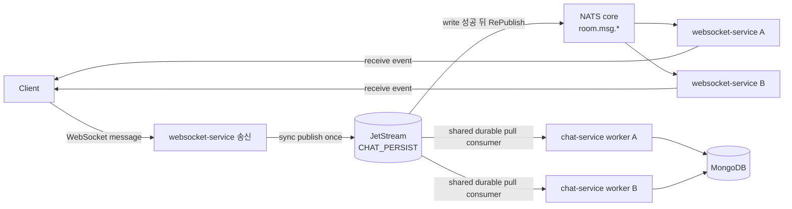

<!-- RFC 상태: Draft | Experimenting | Accepted | Rejected -->
<!-- RFC 목차: 0. 요약 → 1. 배경과 목표 → 2. 제안 → 3. 계약 변경 → 4. 구현 범위 → 5. 대안과 트레이드오프 → 6. 검증 → 7. 결론과 후속 작업 -->

# RFC-0002: JetStream 기반 내구성 메시지 저장

| 항목 | 내용 |
| :--- | :--- |
| 상태 | Accepted |
| 작성자 | happyhun |
| 결정일 | 2026-09-17 |
| 작업 브랜치 | `experiment/jetstream-persistence` |
| 대상 | websocket-service, chat-service, frontend, NATS JetStream, MongoDB, Kubernetes, 관측성, 부하 테스트 |
| 기준 문서 | [RFC-0001](0001-stateless-websocket-broadcast.md), [DESIGN.md](../DESIGN.md), [Kubernetes C10K 부하 테스트 보고서](../K8S_C10K_REPORT.md) |

## 0. 요약

RFC-0001의 WebSocket 양방향 송수신과 기존 인증·멤버십 검증·rate limit을 유지한다. REST 송신 분리와 gateway 정책 변경은 이번 범위에서 제외한다. 메시지마다 멤버십 DB 조회나 추가 RPC를 도입하지 않는다.

websocket-service는 `chat.persist.{roomID}`에 메시지를 한 번 동기 발행한다. NATS는 stream write 성공 뒤 `room.msg.{roomID}`로 Core RePublish하고, 모든 websocket-service Pod는 기존 Core subscription으로 이를 수신한다. 동시에 여러 chat-service Pod가 하나의 durable pull consumer를 공유해 저장 작업을 경쟁 소비하고 최대 500개 또는 100ms 단위로 MongoDB에 저장한 뒤에만 ack한다.

JetStream은 프로세스 로컬 저장·재시도 큐를 대체한다. 짧은 네트워크 혼잡과 일시 timeout은 full-jitter backoff가 적용된 redelivery로 흡수한다. MongoDB 전체 장애처럼 재시도가 의미 없는 동안에는 consumer가 pull을 멈추고 backlog를 stream에 보존하고, health probe가 성공하면 저장을 재개한다. 수락한 정상 메시지는 장애 시간이나 전달 횟수만으로 DLQ에 보내지 않으며, 영구 데이터 오류만 DLQ로 격리한다.

전역 메시지 sequence는 도입하지 않는다. 클라이언트는 연결별 `frame_no`, reconnect와 주기적 sync로 누락 가능성을 감지하고, 고정 recovery cursor와 겹침 구간을 유지하면서 MongoDB 조회를 full-jitter exponential backoff로 재시도한다. 이는 모든 누락을 증명하는 strong consistency가 아니라, 정해진 retry window 안의 bounded eventual recovery 계약이다.

## 1. 배경과 목표

RFC-0001의 websocket-service는 client frame을 검증하고 Core NATS로 브로드캐스트한 뒤 프로세스 로컬 채널에서 chat-service `BatchCreateMessages`를 호출한다. 최대 500개 또는 100ms 배치와 최대 5회 재시도로 MongoDB 부하를 줄이지만 다음 실패 구간이 남는다.

| 상황 | 현재 결과 |
| :--- | :--- |
| websocket-service 프로세스 종료 | 메모리 저장·재시도 큐의 메시지 유실 가능 |
| 재시도 큐 포화 | 실패 배치를 로그와 지표만 남기고 폐기 |
| 재시도 횟수 소진 | 이미 브로드캐스트한 메시지를 영구 폐기 |

이번 RFC의 목표는 다음과 같다.

- 기존 WebSocket 송수신과 edge 정책을 유지해 JetStream 도입 비용을 분리한다.
- Core 브로드캐스트 전에 메시지가 프로세스 밖의 내구성 큐에 수락되도록 한다.
- MongoDB 저장은 비동기 배치로 유지해 DB와 WebSocket fan-out 부하를 분리한다.
- 일시 네트워크 오류는 자동 복구하고 MongoDB 재시작을 포함한 장기 장애에도 retry storm 없이 복구 뒤 저장을 재개한다.
- JetStream과 PVC가 보존되고 MongoDB가 복구되는 조건에서, 수락한 정상 메시지가 최종적으로 MongoDB에 저장되도록 한다.
- 전역 메시지 sequence 없이 감지된 누락과 재연결 구간을 DB에서 eventual recovery한다.
- JetStream 영속성으로 인한 송신 수락과 end-to-end 전달 P99 손실을 측정한다.

다음 항목은 목표가 아니다.

- JetStream을 채팅 이력의 source of truth로 사용하는 것
- 모든 WebSocket 누락을 수학적으로 증명하는 전역·방별 연속 sequence
- REST 송신 분리, Redis 기반 전역 메시지 rate limit과 HTTP idempotency
- 실시간 수신 직후 MongoDB read-after-write를 보장하는 것
- NATS cluster나 다중 AZ 구성을 설계·비교·실험하는 것
- MongoDB 장기 장애 중에도 신규 메시지를 무제한 수락하는 것

이 RFC는 Accepted RFC-0001의 무상태 WebSocket 구현을 선행 상태로 삼는다.

## 2. 제안

### 2.1 아키텍처

| 구성 요소 | 책임 |
| :--- | :--- |
| websocket-service 송신 | 기존 메시지 검증과 제한, UUIDv7 확정, JetStream publish 한 번 |
| JetStream | MongoDB 저장 전 durable backlog, write 성공 뒤 Core RePublish |
| chat-service consumer | batch insert, 오류 분류, ack/NAK와 circuit breaker |
| websocket-service | Core NATS 방 구독과 로컬 WebSocket fan-out |
| frontend | 기존 WebSocket 송수신, optimistic UI, 중복 제거와 DB sync |

api-gateway의 기존 책임은 변경하지 않는다. websocket-service의 로컬 저장 큐를 JetStream으로 대체하고 MongoDB 저장은 chat-service worker가 담당한다.

### 2.2 WebSocket 송신과 영속 수락

1. 기존 연결·방 구독 과정에서 인증과 멤버십을 검증한다.
2. websocket-service가 client frame과 기존 메시지 제한을 검증하고 UUIDv7 message id를 확정한다.
3. `Nats-Msg-Id`를 방·발신자·`client_msg_id`·종류·본문을 구분자로 연결한 SHA-256으로 설정해 `chat.persist.{roomID}`에 한 번 동기 발행한다. 생략한 종류는 `chat`으로 채우며 본문은 변경하지 않는다.
4. NATS가 stream write 성공 뒤 subject mapping으로 `room.msg.{roomID}`에 Core RePublish한다.
5. websocket-service Pod들이 RePublish destination만 Core subscribe하고 기존 WebSocket server frame으로 전달한다.
6. frontend가 수신 메시지를 optimistic message와 병합한다.

publish timeout은 서버가 저장했지만 응답만 유실된 모호한 결과일 수 있다. 동일 scoped key와 payload의 재발행은 같은 `Nats-Msg-Id`를 사용해 duplicate window 안의 stream 중복을 막는다. 같은 scoped key의 다른 payload는 다른 fingerprint로 stream에 들어가 MongoDB unique 충돌 검증과 DLQ 대상이 된다. window가 지났거나 새 message id가 생성돼도 scoped client key의 MongoDB unique 제약으로 논리 중복 저장을 막는다. 같은 응답 ID를 보장하는 Redis ledger나 별도 수락 응답은 도입하지 않는다.

WebSocket 쓰기 성공은 영속 수락 확인이 아니며 echo 부재도 미수락을 증명하지 않는다. 서버의 수락 기준은 성공 `PubAck`다. RePublish echo는 stream write 성공의 증거이지만 송신 Pod가 `PubAck`를 받았다는 증거는 아니다. RePublish는 Core NATS best-effort fan-out이므로 Pod별 ACK나 replay를 제공하지 않는다. 감지한 NATS disconnect·방 구독 slow consumer·전달 지연 초과에는 해당 연결을 종료하고 MongoDB 저장 뒤 reconnect/sync로 회수한다. 발행 실패 시 세션을 종료한다. 명시적인 수락 거부에는 RePublish가 없지만 timeout에는 저장과 echo가 이미 발생했을 수 있다.

frontend는 echo가 10초 안에 오지 않은 낙관적 메시지를 미확인 상태로 표시한다. 사용자가 다시 보내기를 선택하면 원래 `client_msg_id`와 payload를 유지하고, 최초 송신 직전의 history cursor부터 DB sync를 수행한다. 자동 재발행으로 중복 트래픽을 만들지 않으며, 로컬 WebSocket 쓰기 성공만으로 수락 상태를 표시하지 않는다.

### 2.3 Stream과 consumer

| 항목 | 제안 값 | 이유 |
| :--- | :--- | :--- |
| stream | `CHAT_PERSIST` | 메시지 저장 작업 전용 |
| subject | `chat.persist.*` | 마지막 token의 room id를 RePublish destination에 매핑 |
| storage | File | 프로세스 재시작 뒤 복구 |
| retention | WorkQueue | MongoDB 저장과 ack가 끝난 작업 제거 |
| replicas | 1 | RFC-0001의 단일 NATS 실험 범위 유지 |
| discard | New | 과거 pending을 지우지 않고 신규 수락 거부 |
| max bytes | 환경별 명시값 | 디스크 고갈 전 backpressure |
| max age | 없음 | 미처리 정상 메시지를 시간 경과로 폐기하지 않음 |
| duplicate window | 2분 | 동일 envelope 재발행 중복 적재 억제, 영구 멱등성은 DB 제약으로 처리 |
| republish | `chat.persist.*` → `room.msg.$1` | room id token을 매핑해 write 성공 뒤 Core fan-out |
| file sync | NATS 기본 periodic sync, 현재 2분 | 매건 fsync 없이 page cache write를 주기적으로 동기화 |

`max_bytes`는 `최대 발행 bytes/s × 허용 MongoDB 장애 시간 × 안전 계수`로 산정한다. PVC와 server file store 한도는 stream 한도보다 크게 둔다. Kubernetes의 단일 NATS Deployment는 단일 replica StatefulSet과 PVC로 바꾼다. `chat.persist.*`는 stream 입력 전용이며 Core subscriber를 두지 않는다. websocket-service는 RePublish destination인 `room.msg.*`만 subscribe한다.

기존 실험 배포의 DLQ subject `chat.persist.dlq`는 새 입력 wildcard와 겹친다. 기존 stream을 삭제하지 않고 DLQ subject를 `chat.dlq.persistence`로 먼저 갱신한 뒤 `CHAT_PERSIST` subject와 consumer filter를 갱신한다. 미처리 메시지를 둔 상태의 재시작도 통합 테스트로 검증한다.

Consumer는 `chat-persistence` durable pull consumer 하나를 모든 chat-service Pod가 공유한다. 최대 500개 또는 100ms 단위로 MongoDB `InsertMany(ordered=false)`를 실행하고 성공하거나 멱등 중복임을 확인한 메시지만 explicit ack한다. 부분 성공 뒤 재전달돼도 message `_id`와 `(room_id, sender_id, client_msg_id)` unique 제약으로 수렴한다.

각 chat-service Pod는 시작 시 설정된 수의 저장 worker를 실행하며 기본값은 1이다. 별도 worker Deployment나 leader election을 두지 않고, 모든 worker가 기존 `chat-persistence` consumer에 연결한다. 따라서 전체 worker 수는 `Pod 수 × Pod당 worker 수`다. Pod별 consumer를 생성하거나 메시지를 모든 worker에 복제하지 않는다.

worker는 한 번에 batch 하나만 저장하고 처리 중에는 다음 batch를 미리 pull하지 않는다. Pod마다 `mongo.Client` 하나와 connection pool을 조회·저장 worker가 공유한다. pool을 connection 하나로 제한하거나 worker마다 Client를 만들지 않는다. pool 한도는 기존 Mongo URI 옵션으로 설정하며 replica 수 증가에 따른 총 연결 수도 검증한다. worker 수 증가가 MongoDB 처리량의 선형 증가를 보장하지 않으며, DB 과부하에서는 circuit과 pull 중단이 우선한다. 스케일인 시에는 신규 pull을 멈추고 진행 중 batch를 완료하거나 미ack 상태로 남겨 다른 Pod가 재처리한다.

현재 chat-service는 고정 replica이며 HPA 대상이 아니다. 이번 범위는 replica 증감에 worker 수가 자동으로 따라가고 기존 gRPC endpoint 갱신이 정상 동작하는지 검증하는 것까지다. HPA 도입과 persistence backlog를 입력 지표로 사용하는 정책은 별도 후속 과제로 남긴다.

consumer `AckWait`는 30초, MongoDB batch 작업 전체 timeout은 5초, health probe timeout은 2초로 시작한다. batch 작업 timeout은 pool·server selection 대기와 driver 재시도까지 포함한다. `MaxAckPending`은 롤링 업데이트 surge를 포함한 최대 동시 Pod 수에 Pod당 worker 수와 batch size 500을 곱한 값으로 설정한다. 자동 미ack 만료 재전달에는 `AckWait`를 사용하고, 애플리케이션 재시도에는 명시적인 지연 NAK를 사용한다. 별도 consumer `BackOff`나 ACK 연장 loop는 두지 않는다.

### 2.3.1 MongoDB 내구성과 부분 성공

단일 MongoDB의 메시지 collection은 `w:1, j:true`로 저장한다. journal 확인까지 성공한 메시지만 JetStream ACK 대상으로 삼는다. write concern 실패, timeout 또는 네트워크 단절처럼 결과가 모호하면 성공 여부를 추정하지 않고 미ack 상태로 재전달한다.

`InsertMany(ordered=false)`의 문서별 오류를 원래 batch 위치에 대응시켜 처리한다. write concern이 충족된 batch에서 성공한 문서는 ACK하고 영구 validation 오류는 해당 문서만 DLQ로 보낸다. duplicate key는 기존 문서를 `_id` 또는 `(room_id, sender_id, client_msg_id)`로 조회해 `room_id`, `sender_id`, `client_msg_id`, `type`, `content`가 모두 같을 때만 멱등 성공으로 처리한다. 새로 발급된 message id와 생성 시각 차이만으로 payload 충돌로 판단하지 않는다. 조회 실패·내구성 확인 실패는 재시도하고, 내용이 다르면 충돌로 DLQ에 격리한다.

실험 전 Kubernetes MongoDB는 `emptyDir`이므로 Pod 교체 후 기존 이력 보존을 보장하지 않았다. 이 실험에서는 기존 단일 MongoDB Deployment를 유지하되 PVC를 mount하고 동시 실행을 막는 `Recreate` 전략을 사용한다. MongoDB replica set이나 cluster는 추가하지 않는다. 최종 저장 보장은 NATS PVC뿐 아니라 MongoDB PVC 보존도 전제로 하며, journal 확인은 PVC 영구 손실을 막지 못한다.

### 2.4 재시도와 장기 장애

MongoDB 배포 형태와 연산이 지원하는 범위에서 Go driver의 기본 retryable write는 유지하되, 애플리케이션이 같은 호출을 즉시 반복하는 별도 loop는 두지 않는다. 첫 저장 실패 이후의 내구성 재시도는 JetStream redelivery가 담당한다.

오류는 다음처럼 분류한다.

| 분류 | 예 | 처리 |
| :--- | :--- | :--- |
| 일시적 | 짧은 network timeout, connection reset, 일시적 primary 전환, pool 혼잡 | ack하지 않고 full-jitter 지연 NAK |
| 의존성 장애 | MongoDB 단절, server selection 불가로 배치 저장이 연속 실패 | 실패 임계치에 circuit open, 신규 pull 중단, 낮은 빈도 health probe |
| 과부하 | connection pool 고갈, deadline 초과로 배치 저장이 연속 실패 | 실패 임계치에 pull 중단과 backlog 증가, 복구 뒤 재개 |
| 영구 오류 | schema/decode 실패, validation 실패, 동일 id의 payload 충돌 | 재시도 없이 DLQ 보관 후 종료 처리 |
| 종료 | context canceled, Pod shutdown | 새 pull 중단, 가져온 배치는 제한 시간 내 처리하고 미ACK 작업은 재전달 |

consumer는 정상 메시지에 전달 횟수 제한을 두지 않는다. `MaxDeliver=-1`을 사용하고 stream `MaxAge`도 설정하지 않아, MongoDB 장애가 길어져도 미ack 메시지가 pending으로 남게 한다. 이는 같은 DB 호출을 무한히 반복한다는 뜻이 아니다. 짧은 일시 오류에는 `250ms, 1s, 3s` 상한의 full-jitter 지연 NAK를 적용하고, 연속 DB 실패 3회에 Pod 단위 circuit을 열어 모든 저장 worker의 pull을 멈춘다. batch 저장 성공 시 연속 실패 수를 초기화한다. 설정 시작값은 부하·장애 실험 결과로 확정한다.

Pod마다 MongoDB probe 하나를 실행한다. ping 실패는 조회 health를 내리지만 closed circuit을 직접 열지는 않는다. 배치 실패 임계치로 circuit이 열린 뒤에는 신규 pull을 멈추고 `1s, 2s, 5s, 10s, 30s` 상한의 full-jitter health probe로 복구를 확인한다. 이미 가져온 batch의 일시 오류에는 지연 NAK를 적용한다. ping이 성공하면 worker 하나가 half-open 상태에서 batch 하나를 처리하고, 저장 성공 시 circuit을 닫으며 실패 시 다시 연다. backlog가 없으면 half-open을 유지하고 다음 trial pull을 허용한다. 따라서 circuit이 열린 동안 새 DB 쓰기는 멈추지만 메시지는 JetStream pending으로 남고, MongoDB 복구 뒤 자동으로 drain된다.

장애가 길어져 stream이 가득 차면 `DiscardNew`가 신규 publish를 거부하고 WebSocket 송신 경로는 성공 echo 없이 세션을 종료한다. 이미 수락한 메시지를 시간이나 재시도 횟수로 폐기하지 않고 명시적인 backpressure를 선택한다. 운영자가 MongoDB를 복구할 수 없는 영구 장애로 판정한 경우에만 별도 관리 절차로 pending을 내보내거나 DLQ에 이동한다.

이 최종 저장 보장은 조건부다. 성공 `PubAck` 뒤 NATS·MongoDB PVC가 유지되고, 운영자가 stream을 purge하지 않으며, MongoDB가 결국 복구되어야 한다. MongoDB가 영구히 복구되지 않거나 어느 PVC든 영구 손실된 경우까지 보장하지 않는다.

DLQ는 persistence 입력 wildcard와 겹치지 않는 `chat.dlq.persistence` subject의 별도 `CHAT_PERSIST_DLQ` Limits stream이다. 원본과 오류 분류를 DLQ에 `PubAck`로 보관한 뒤에만 원본을 종료 처리한다. DLQ publish도 실패하면 원본을 ack하지 않는다.

### 2.5 전역 sequence 없는 누락 복구

JetStream은 DB 저장 작업의 유실을 막지만 Core NATS fan-out의 at-most-once 성격을 바꾸지 않는다. 누락 감지와 회수는 다음 신호를 조합한다.

RePublish의 `Nats-Sequence`는 stream 전체 순서이며 방별 연속 번호가 아니다. `Nats-Last-Sequence`도 WorkQueue에서 ACK 후 제거되는 메시지에 의존하므로 방별 gap 판정에 사용하지 않는다.

- 연결별 `frame_no` gap은 로컬 WebSocket 송신 큐 누락을 감지한다.
- NATS disconnect와 slow consumer는 서버가 세션을 닫아 reconnect/sync를 유도한다.
- reconnect에서는 gap 유무와 관계없이 DB sync를 수행한다.
- 신호 없이 Hub가 메시지를 놓치는 경우에도 최근 범위의 누락을 회수하도록 frontend가 낮은 빈도로 periodic sync한다. 되감기 범위 밖의 누락까지 보장하지는 않는다.

sync는 UUIDv7 `after_id`만 계속 전진시키지 않는다. 누락이나 reconnect가 발생하면 직전의 안정된 recovery cursor를 고정하고, 허용 clock skew와 저장 역전 폭을 포함하는 겹침 구간부터 페이지를 다시 읽는다. 실시간으로 더 큰 id를 받아도 복구 중인 cursor를 건너뛰지 않는다. `id`와 `client_msg_id`로 결과를 중복 제거한다.

MongoDB 반영은 비동기이므로 빈 조회를 곧바로 복구 완료로 해석하지 않는다. frontend는 설정된 최대 경과 시간 안에서 full-jitter exponential backoff로 같은 recovery range를 재조회한다. window가 끝날 때 마지막 조회 오류가 남아 있으면 `exhausted` 상태로 UI에 재동기화 안내를 표시한다. 성공 응답에 특정 메시지가 나타나지 않았다는 이유만으로 누락을 판정하거나 별도 `sync_exhausted` 메트릭을 기록하지 않는다. reconnect·브라우저 focus 복귀·수동 재시도 때 보존한 anchor부터 다시 확인한다.

실험 시작값은 sync retry window 60초, backoff 상한 10초, 정상 periodic sync 30초다. 페이지 전체 조회에도 window의 남은 시간을 적용한다. 방별 미해결 recovery anchor는 가장 오래된 값 하나로 합쳐 사용자·방 key의 `sessionStorage`에 보관한다. window 소진 시 자동 anchor 재시도를 종료하고 anchor는 전진시키거나 삭제하지 않는다. 전체 과거 범위를 주기적으로 무한 재조회하지 않으며, reconnect·focus 복귀·수동 재시도 때 같은 anchor부터 다시 읽는다. 이전 window가 끝났다면 새 60초 window를 시작하고, 진행 중이면 기존 deadline을 유지한다. 정상 periodic sync는 최근 범위만 조회하고 전체 요청 budget은 5초다. 빈 결과나 마지막 페이지 도달만으로 완전성을 선언하지 않는다. 저장 지연을 증명하는 watermark를 추가하지 않으므로 anchor는 탭 세션 동안 유지한다. 조회 오류가 남아도 무기한 loading으로 화면을 막지 않는다. 60초를 초과한 저장 지연은 자동 복구 보장 밖이며 이후 복귀 이벤트나 수동 재시도가 필요하다. 탭 종료·로컬 상태 손실이나 감지되지 않은 누락도 이 재조회 계약 밖이다.

이 계약은 감지된 누락과 재연결 구간을 실무적인 시간 안에 회수하는 bounded eventual recovery다. 전역 또는 방별 연속 sequence가 없으므로 모든 누락의 부재나 특정 시점까지의 완전성을 증명하지 않는다.

### 2.6 종료와 장애 처리

| 상황 | 동작 |
| :--- | :--- |
| JetStream 명시적 수락 거부 | 해당 발행의 RePublish 없음, 세션 종료 |
| JetStream publish timeout·응답 유실 | 저장·RePublish 여부가 모호하므로 성공으로 확정하지 않고 세션 종료, 같은 key로 조회·재시도 |
| RePublish를 WS Pod가 놓침 | Core replay 없음, continuity loss 감지 시 reconnect 뒤 MongoDB sync |
| 짧은 MongoDB network 오류 | jittered redelivery 뒤 저장 |
| MongoDB 장기 장애·Pod 재시작 | circuit open, pull 중단, 복구 감지 뒤 pending 저장 재개 |
| stream/PVC 용량 한계 | 신규 메시지 수락 거부와 경보 |
| chat-service consumer 종료 | 미ack 메시지를 다른 worker에 재전달 |
| 영구 데이터 오류 | DLQ 보관 후 원본 종료 처리와 경보 |
| nats-server 재시작 | 같은 PVC에서 stream과 consumer 복구 |
| NATS 저장소 영구 손실 | replicas=1이므로 복구 보장 없음 |

websocket-service는 더 이상 저장 큐를 drain하지 않는다. chat-service consumer는 종료 때 신규 pull을 멈추고 진행 중 batch만 제한 시간 안에 완료·ack한다. 제한 시간을 넘기면 ack하지 않고 종료한다.

Kubernetes liveness는 MongoDB 상태와 분리한다. chat-service는 초기 MongoDB ping 실패만으로 종료하지 않고 query health와 persistence circuit을 degraded 상태로 시작한다. URI·설정 오류는 기동 실패로 처리한다. MongoDB 복구 뒤 같은 Pod에서 조회·저장을 재개하며 기존 공통 `database.NewMongo` fail-fast 계약은 바꾸지 않는다. history/sync 장애는 `503 Service Unavailable`과 `Retry-After`로 전달한다. 저장 장애가 WebSocket 송수신 readiness를 내리지 않도록 한다. 인덱스는 트래픽 전환 전에 준비하고 데이터·인덱스 손실은 자동 복구 대상으로 간주하지 않는다.

### 2.7 단일 NATS 장애 계약

이번 RFC는 nats-server Pod 하나, JetStream `replicas=1`, PVC 하나만 사용한다. 이는 프로세스 로컬 메모리 큐보다 내구성을 높이기 위한 구성이지 고가용성 구성은 아니다.

| 상황 | 보장과 한계 |
| :--- | :--- |
| nats-server 프로세스·Pod 재시작 | 같은 정상 PVC를 다시 mount하고 store를 복구하면 미처리 메시지와 consumer 상태를 유지한다. 재시작 중 신규 송신과 Core fan-out은 실패한다. |
| NATS 연결 단절 | `PubAck`를 확인하지 못한 송신은 성공으로 간주하지 않는다. 동일 `client_msg_id` 재시도로 모호한 publish 결과를 수렴시킨다. |
| Kubernetes 노드 장애 | 사용 중인 StorageClass가 다른 노드로 PVC를 정상 재연결하는 범위에서만 복구할 수 있다. 재연결 시간 동안 메시지 송수신은 중단된다. |
| PVC 삭제·손상·영구 손실 | 아직 MongoDB에 저장되지 않은 수락 메시지와 consumer 상태를 잃을 수 있으며 이 RFC는 복구를 보장하지 않는다. |
| nats-server와 MongoDB 동시 장애 | PVC에 남은 메시지만 보존한다. NATS가 먼저 복구되어야 신규 수락과 MongoDB drain을 재개할 수 있다. |
| stream 한도·PVC 고갈 | `DiscardNew`로 기존 pending을 보호하고 신규 송신을 실패시킨다. 디스크 자체가 고갈되기 전에 경보해야 한다. |
| 계획 점검·업그레이드 | 다른 replica로 failover하지 않으므로 점검 시간만큼 송신과 실시간 fan-out이 중단된다. |

FileStorage write는 OS page cache를 거치며 NATS 기본 `sync_interval`에 따라 묶어 디스크에 동기화한다. 실험 시 실제 서버 값과 현재 기본값 2분을 기록한다. 이는 매건 fsync가 아니므로 host 전원·kernel 장애에서는 마지막 sync 이후 메시지를 잃을 수 있고, 복제본이나 백업도 만들지 않는다. 따라서 이 RFC의 내구성 계약은 "정상 PVC가 보존되는 프로세스·Pod 장애와 MongoDB 일시 장애"에 한정하며, NATS 가용성 SLO나 무손실 재해 복구를 주장하지 않는다.

## 3. 계약 변경

### 3.1 WebSocket과 조회

| 계약 | 변경 |
| :--- | :--- |
| WebSocket client/server frame | RFC-0001 양방향 송수신과 기존 `frame_no` 유지 |
| 브로드캐스트 경계 | stream write 성공 뒤 NATS 서버가 Core RePublish |
| history/sync | UUIDv7 cursor, 겹침 조회와 bounded retry |

메시지 송신 HTTP API와 Redis idempotency 계약은 추가하지 않는다. 실시간 수신은 MongoDB 즉시 조회를 보장하지 않는다. scoped client key로 재송신과 redelivery의 논리 중복을 병합한다.

### 3.2 내부 계약

| 계약 | 변경 |
| :--- | :--- |
| chat gRPC | history/sync 유지, 로컬 저장 큐용 `BatchCreateMessages` 제거 |
| `chat.persist.{roomID}` | 전체 메시지 envelope를 담는 JetStream 입력 subject |
| `CHAT_PERSIST` | file-backed WorkQueue stream |
| `chat-persistence` | chat-service가 공유하는 durable pull consumer |
| `room.msg.{roomID}` | stream RePublish destination, Core NATS 실시간 fan-out |
| MongoDB | `_id`와 client message key의 redelivery 멱등성 강화 |

## 4. 구현 범위

| 구성 요소 | 최종 변화 |
| :--- | :--- |
| chat-service | 기본 worker 1과 설정된 동시성, 공유 durable consumer, Mongo 장애 중 기동 |
| websocket-service | 기존 client chat frame 유지, JetStream publish 한 번, `room.msg.*` Core subscribe, 로컬 저장·재시도 큐와 저장용 chat client 제거 |
| frontend | 기존 WebSocket 송신, optimistic merge, jittered sync retry |
| MongoDB | journal 확인, 문서별 부분 성공 처리, unique 제약과 동일 payload 확인 |
| NATS | JetStream file store, WorkQueue와 DLQ, subject RePublish, 기본 periodic sync 실험 |
| Kubernetes | NATS StatefulSet/PVC, 단일 MongoDB PVC와 Recreate, service별 health와 replica 변경 검증 |
| 관측성 | publish ack, persistence retry/circuit/backlog/DLQ 지표 |
| 부하 테스트 | C10K 성능 비교와 HPA 정합성·MongoDB 장애 시나리오 |

WebSocket 송신 경로를 복원하고 MongoDB PVC·인덱스, JetStream/PVC와 chat-service consumer를 적용한다. 인덱스 생성이 기존 중복 때문에 실패하면 전환을 중단하고 데이터를 자동 삭제하지 않는다. REST와 WebSocket을 함께 지원하는 호환 계층은 추가하지 않는다. 이번 실험은 무중단 rolling migration을 보장하지 않는다.

## 5. 대안과 트레이드오프

| 대안 | 판단 |
| :--- | :--- |
| WebSocket 양방향 송수신 유지 | 송신 경로 변경 비용을 배제하기 위해 채택 |
| REST 송신 분리 | 별도 아키텍처 변경이므로 이번 실험에서 제외 |
| MongoDB 동기 저장 뒤 `201` | read-after-write는 강하지만 DB 지연·장애가 송신 경로에 결합돼 제외 |
| MongoDB + transactional outbox | 강한 DB/event 정합성이 필요할 때 유효하지만 비동기 배치 목표와 맞지 않아 제외 |
| Core 발행 뒤 비동기 JetStream 발행 | 브로드캐스트 후 producer 종료 유실이 남아 제외 |
| 애플리케이션의 JetStream·Core 이중 publish | 실패 분기와 코드 중복을 만들므로 제외 |
| stream write 뒤 NATS RePublish | publish 한 번으로 durable-before-broadcast 경계를 얻어 채택 |
| Pod별 JetStream consumer | 실시간 replay는 가능하지만 consumer 관리·fan-out 비용이 커 이번 범위에서 제외 |
| 유한 `MaxDeliver` 뒤 DLQ | MongoDB 재시작이 길어지면 정상 메시지도 영구 오류처럼 격리하므로 제외 |
| 회로 차단 없는 무제한 redelivery | 장기 장애에서 retry storm을 만들므로 제외 |
| 전역 stream sequence cursor | 완전성 증명은 강화하지만 외부 계약과 저장 스키마 복잡도가 커 목표에서 제외 |

채택 시 감수하는 대가는 다음과 같다.

- JetStream append·`PubAck`와 주기적 fsync가 전달 P99와 NATS 자원에 추가된다.
- 실시간 수신 직후 MongoDB 조회에서 메시지가 보이지 않을 수 있다.
- 사용자·방별 메시지 rate limit은 Pod 메모리 기준이므로 여러 Pod를 합친 전역 제한은 아니다.
- Core RePublish 누락은 직접 replay하지 않고 DB sync로 회수한다.
- sequence 없는 누락 복구는 retry window 밖의 완전성을 보장하지 않는다.
- MongoDB 장기 장애는 결국 stream 용량에 도달해 신규 송신을 중단시킨다.
- 수락한 메시지의 최종 저장은 MongoDB 복구와 NATS·MongoDB PVC 보존을 전제로 한다.
- single NATS replica와 PVC는 노드·볼륨 영구 손실을 견디지 못한다.

## 6. 검증

### 6.1 성능 비교: C10K

[RFC-0001 6절](0001-stateless-websocket-broadcast.md)의 결과와 [main C10K 부하 테스트 보고서](../K8S_C10K_REPORT.md)를 구분해 참고하고 JetStream 후보를 같은 호스트와 동일한 C10K 조건에서 한 번 실행한다. 결과가 경계에 걸리거나 재현성 확인이 필요할 때만 한 번 재실행하며, 기준을 넘으면 추가 반복 대신 원인을 분석한다. 기준 보고서와 현재 호스트·부하 스크립트·Pod 자원·MongoDB write concern 중 하나라도 달라 직접 비교할 수 없으면 과거 수치를 참고치로만 사용한다. 한 호스트에 기존 개발 클러스터와 실험 클러스터를 동시에 띄우지 않는다. 기존 클러스터의 중지·재생성·설정 변경은 사용자 확인 없이 수행하지 않는다. 실행 전에 호스트와 발생기의 자원 여유를 확인하고, 발생기 오류나 서비스 재시작이 있으면 원인을 보고한 뒤 비교 실험을 중단한다.

| 대상 | 목적 |
| :--- | :--- |
| 기준선: RFC-0001 WebSocket 송신 + 메모리 저장 큐 | RFC-0001 6절의 최대 P99 31ms 참고 |
| main: ws-gateway 구조 | 기존 C10K 보고서의 최대 P99 43ms 참고 |
| 후보: WebSocket 송신 + JetStream + RePublish + 기본 periodic sync | stream write와 durable 수락 비용 측정 |

기존 10,000 VU, 100개 방, 5초 메시지 간격, 128B payload와 k6 worker 4개 조건을 유지한다. 다음 지표를 분리한다.

부하 실행은 기존 Makefile과 `deploy/k8s/scripts/load.sh` 경로를 사용한다. 임시 runner나 추가 클러스터를 만드는 전용 스크립트는 두지 않는다. 정합성 대조는 HPA 테스트에서 수행하고 C10K에서는 전수 receipt나 DB export를 수행하지 않는다. worker 요약 4개가 모두 존재하고 부하 중 OOM·probe 재시작이 없으며 실제 활성 WebSocket 연결이 목표에 도달한 실행만 정상 구간 비교에 사용한다.

- `end_to_end_delivery_latency`: WebSocket 송신부터 echo까지
- JetStream publish ack P50/P95/P99/P99.9
- 메시지 UUIDv7 생성 시각부터 MongoDB 저장 성공 처리까지 persistence lag. 현재 계측은 JetStream 수락 시각을 별도로 기록하지 않는다.
- batch size, redelivery, circuit open, pending과 oldest pending age
- NATS, chat-service, websocket-service, MongoDB와 PVC 자원

후보는 end-to-end P99 50ms 미만, 기준선보다 절대 15ms·상대 50% 이하 증가, 메시지 timeout과 정상 구간 publish 실패 0을 모두 만족해야 한다. 반복 실행의 각 worker P99를 평균하지 않고 run별 worker 최댓값으로 판정한다. 정상 메시지의 최종 집합 수렴은 HPA 정합성 테스트에서 확인한다.

송신·인가·rate limit·발생기·자원과 MongoDB write concern을 기준선과 동일하게 맞춘다. MongoDB는 `w:1, j:true`로 통일하고 조건이 다르면 JetStream만의 비용으로 해석하지 않는다. worker 기본값 1을 유지하며 2·4 비교는 채택 조건이 아니다. 기본 후보가 P99 기준을 통과한 뒤 persistence lag가 병목일 때만 별도 실험하고, lag·pool 대기·DB 부하와 전달 P99가 함께 개선될 때 기본 동시성을 늘린다.

### 6.2 정합성과 장애 검증: HPA

| 시나리오 | 기대 결과 |
| :--- | :--- |
| 짧은 network delay/reset 주입 | jittered redelivery 안에 저장, DLQ 0 |
| MongoDB 일시 primary 전환 | replica set을 도입하지 않은 단일 MongoDB에서는 검증 대상에서 제외 |
| MongoDB Pod 삭제·재시작 | pull 중단, 정상 메시지 DLQ 0, 복구 감지 뒤 pending 0 |
| MongoDB 저장·ACK 뒤 Pod 교체 | 같은 MongoDB PVC에서 기존 이력 유지 |
| MongoDB 중단 중 chat-service 재시작 | WebSocket 영속 수락 유지, query 503, DB 복구 뒤 같은 Pod에서 저장 재개 |
| MongoDB 장시간 중단 | DB 쓰기 호출은 멈추고 낮은 빈도 probe만 수행, pending 증가, 복구 뒤 drain |
| MongoDB 중단 중 nats-server Pod 재시작 | 같은 PVC에서 pending과 consumer 복구, MongoDB 복구 뒤 누락 없이 저장 |
| nats-server 중단 중 WebSocket 송신 | 성공 echo와 Core 발행 없음, 복구 뒤 같은 `client_msg_id` 재시도 성공 |
| batch 저장 직후 ack 전 consumer 종료 | redelivery 후 멱등 저장, 논리 중복 0 |
| 부분 성공·write concern 실패·응답 유실 | 확인된 성공만 ACK, 모호한 결과 재처리, 논리 중복 0 |
| 동일 scoped client key 재송신 | 동일 payload는 DB 문서 하나, 다른 payload는 충돌 DLQ |
| chat-service 1→3→1 Pod 스케일 변경 | 기본 동시성 1에서 worker 수도 1→3→1, gRPC endpoint 갱신, 동일 consumer 공유, 스케일인 중 최종 누락·논리 중복 0 |
| 영구 schema 오류 한 건 | 해당 메시지만 DLQ, 정상 메시지 계속 처리 |
| stream 최대 용량 도달 | 기존 pending 보존, 신규 송신 실패 |
| 기존 stream 설정에서 업그레이드 | DLQ subject를 먼저 변경, 기존 pending과 durable consumer 유지 |
| Core fan-out 한 건 누락 | frontend sync retry window 안에 DB에서 회수 |
| sync retry window보다 긴 MongoDB 장애 | 미해결 anchor 유지, 복구 뒤 동일 범위 재조회로 회수 |

MongoDB 장애 테스트는 저장 시도 수가 backlog 크기나 장애 시간에 비례해 계속 증가하지 않는지 확인한다. circuit open 동안 health probe 외 `InsertMany` 호출은 없어야 한다. 장애 전과 장애 중 성공 `PubAck`를 받은 정상 메시지는 MongoDB 복구 뒤 모두 저장되어야 하며, 전달 횟수 때문에 DLQ로 이동한 메시지는 0이어야 한다.

### 6.3 코드 검증 항목

아래는 검증 기준이며 전체 명령의 완료 목록이 아니다. 실행 결과와 미검증 범위는 6.5절 및 연결된 보고서에서 구분한다.

- 변경 파일 `gofmt`
- `go test ./...`
- `go test -race ./...`
- `go test -count=1 -tags=integration ./...`
- `golangci-lint run`
- `npm --prefix frontend run lint`
- `npm --prefix frontend run build`
- `make k8s-validate`
- `make test-up` 후 `go test -count=1 -tags=e2e ./test/e2e`
- k6 inspect와 모드별 부하 실행

### 6.4 구현 리뷰 기준

실험 브랜치는 WebSocket 양방향 송수신, JetStream shared durable pull consumer, MongoDB 문서별 ACK와 프론트엔드 복구 조회를 사용한다. join/leave 등의 system 이벤트는 기존 내부 API와 Core NATS로 전달하되 MongoDB 영속 대상에서 제외한다. 영속 접수 계약은 사용자 chat 메시지에 적용한다.

단위·통합 테스트와 코드 리뷰의 확인 기준은 다음과 같다.

- 송신마다 DB 조회나 추가 RPC가 없으며 기존 인증·멤버십 검증을 제거하지 않는다.
- NATS fetch 오류와 MongoDB write 오류를 분리한다. fetch 실패는 DB circuit 상태를 바꾸지 않는다.
- network/write concern 결과가 불명확한 배치는 ACK하지 않는다. unordered bulk의 문서별 영구 오류만 DLQ로 분리한다.
- 같은 payload의 duplicate만 저장 성공으로 처리하고, 재송신으로 ID가 달라져도 scoped logical key로 중복을 제거한다.
- half-open은 Pod당 한 worker만 실제 배치 쓰기를 시도한다. 빈 pull은 circuit을 닫지 않는다.
- shutdown은 새 pull을 중단하고 이미 받은 배치를 write timeout 내에서 drain한다. 미확인 메시지는 unacked로 남긴다.
- 낙관적 프론트엔드 메시지는 복구 cursor를 전진시키지 않으며 중복 이벤트는 scoped client key로 병합한다.
- 테스트 데이터 정리는 MongoDB index를 보존한다. 실제 재시작 복구 검증은 같은 저장소를 유지한다.

### 6.5 최종 검증 결과

2026-09-16 KST, AC 전원에서 기존 클러스터를 삭제하고 `make dev-up` 후 C10K를 한 번 실행했다. 10,000 VU 목표로 약 16분간 실행했으며 실제 활성 WebSocket은 최대 9,996개였다.

| 항목 | 결과 |
| :--- | :--- |
| worker별 echo P99 | 38.82 / 36.83 / 42.00 / 50.00ms |
| 최대 worker P99 | 50.00ms — 엄격한 `<50ms` 기준 미통과 |
| main 참고치 43ms 대비 | +7.00ms, 약 +16.3% |
| RFC-0001 참고치 31ms 대비 | +19.00ms, 약 +61.3% |
| 서버 egress P99 | 전체 23.92ms / 최대 부하 유지 26.94ms / 1분 창 최댓값 42.56ms |
| 송신 시도 / probe echo 지연 표본 | 1,185,961 / 11,666건 |
| 오류·timeout·OOM·Pod 재시작 | 모두 0건 |
| 종료 후 stream 잔여 메시지 / DLQ | 0 / 0건 |

worker 4의 P99 threshold만 실패했으며 인프라 장애는 없었다. 기준선은 동일 조건의 동시 대조군이 아니므로 차이를 JetStream 단독 비용이나 충전기만의 효과로 단정하지 않는다. 재현 절차와 상세 수치는 [JetStream C10K 부하 테스트 보고서](../K8S_JETSTREAM_C10K_REPORT.md)에 기록한다.

RFC-0001 대비 단순 수치 차이는 증가폭 기준인 15ms·50%를 넘는다. 다만 RFC-0001은 되감기 재동기화를 측정 경로에서 제외했고 main은 ws-gateway와 이전 런타임 조건이므로 통제된 비용 비교는 아니다. main 서버 egress 기록 24.2ms와 이번 전체 구간 23.92ms도 집계 구간·측정 경계의 동일성이 확인되지 않아 동등성의 증거로 삼지 않는다.

정합성은 기존 HPA 테스트에서 WebSocket 송신으로 검증한다. 송신 시도와 echo 수신을 분리해 기록하고, RePublish echo로 확인한 메시지 ID 집합이 retry window 안에 MongoDB canonical 문서 집합에 포함되는지 방별 history 조회로 대조한다. WebSocket local send 성공은 `PubAck` 증명이 아니므로 echo를 받지 못한 시도는 timeout·연결 종료와 함께 별도 실패로 판정한다. 세션 종료 후 누락 후보를 DB에서 다시 조회하고 미회수 건, 조회 실패, 중복 실시간 전달은 테스트 실패로 판정한다. echo 없이 DB에 존재하는 시도는 모호한 결과이며 HPA 테스트만으로 전체 성공 `PubAck` 집합을 재구성할 수는 없다.

DB 반영 조회는 최대 60초 jittered backoff로 제한한다. 장기 장애는 복구 뒤 backlog drain을 확인하고 최종 대조한다. 정상 수락 집합은 MongoDB 또는 설명 가능한 DLQ와 수렴해야 하며 정상 메시지 누락·논리 중복은 0이어야 한다. HPA 검증은 실행 방의 paginated history만 조회하고 VU별 수신 ID 집합으로 메모리를 제한한다. 전체 수락 집합 대조가 필요한 장애 실험은 서버 측 `PubAck` receipt 수집 수단을 별도로 갖춘 뒤 판정하며, 현재 HPA 조회만으로 그 보장을 주장하지 않는다.

2026-09-16 정합성·장애 복구 결과는 다음과 같다. 재현 명령과 상세 범위는 [JetStream HPA 정합성 테스트 보고서](../K8S_JETSTREAM_HPA_REPORT.md)에 기록한다.

| 검증 | 결과 |
| :--- | :--- |
| QA HPA 1→2 확장, 300 VU | 송신·echo·DB 각각 11,985건, 누락·중복 0 |
| 활성 연결 중 WebSocket 2→1 강제 축소 | 비계획 연결 종료 99건, 송신·echo·DB 각각 12,239건, 누락·중복 0 |
| MongoDB 중단·복구, 저장 worker 재시작·1→3→1, 같은 PVC의 NATS 재시작 | 누적 echo ID 34건과 DB 집합 일치, 단계별 pending·DLQ 0 |
| 직접 PubAck 대조 통합 테스트 | 정상 52건의 DB 집합 일치, 저장 후 ACK 전 중단의 재전달·멱등 저장 확인 |

QA 실행의 DB 미반영·timeout·sync 오류·최종 누락·중복은 0이었다. 강제 축소에 사용한 HPA 설정은 원복했다. 직접 PubAck 통합 테스트의 의도적인 malformed 메시지 1건만 DLQ에 격리됐으며 정상 메시지는 누락되지 않았다. 이 결과를 전체 서버 PubAck 집합의 전수 증명이나 장시간 장애·호스트·디스크 손실 보장으로 확대하지 않는다.

## 7. 결론과 후속 작업

JetStream 기반 내구성 메시지 저장을 채택한다. WebSocket 양방향 송수신을 유지하면서 프로세스 로컬 저장 큐를 shared durable consumer로 대체하고, MongoDB 장애·worker 변경·같은 PVC의 NATS 재시작에 대한 저장 복구를 검증했다. 구현은 완료했으며 이 RFC는 채택된 설계와 검증 결과를 기록한다.

최종 C10K의 최대 worker P99는 50.00ms로 사전에 정한 `<50ms` 기준을 충족하지 못했다. 이 성능 결과와 아래 검증 한계를 수용해 채택하며, 기존 기준이나 측정 수치를 통과로 바꾸지는 않는다.

정합성 검증은 보고서에 명시된 메시지 집합과 장애 시나리오에 한정한다. 장시간 장애, 네트워크 지연 주입, NATS 중단 중 신규 송신은 이번 실행으로 검증하지 않았다. 호스트·디스크 손실의 무손실 복구는 단일 NATS 설계의 보장 범위 밖이다.

후속 과제는 별도 RFC로 분리하며 다음 항목은 RFC-0002의 구현·실험·채택 조건에 포함하지 않는다.

- REST 송신 분리와 gateway 기반 메시지 정책
- 정확한 replay가 필요할 때의 per-room 또는 stream cursor
- NATS 인증, TLS, NetworkPolicy와 계정별 권한
- JetStream 백업·복구와 PVC 장애 대응
- chat-service HPA 도입과 persistence backlog 기반 autoscaling

## 참고 자료

- [NATS JetStream 개념과 at-least-once 전달](https://docs.nats.io/concepts/jetstream)
- [NATS JetStream stream RePublish](https://github.com/nats-io/nats.docs/blob/master/nats-concepts/jetstream/streams.md#republish)
- [NATS JetStream consumer worker pool](https://docs.nats.io/learn/jetstream/worker-pool)
- [NATS JetStream disk sync 보장](https://github.com/nats-io/nats.docs/blob/master/nats-concepts/jetstream/README.md#syncing-data-to-disk)
- [MongoDB retryable writes](https://www.mongodb.com/docs/v7.0/core/retryable-writes/)
- [MongoDB write concern](https://www.mongodb.com/docs/v7.0/reference/write-concern/)
- [NATS pull consumer와 ACK 한도](https://docs.nats.io/learn/jetstream/pull-consumers)
